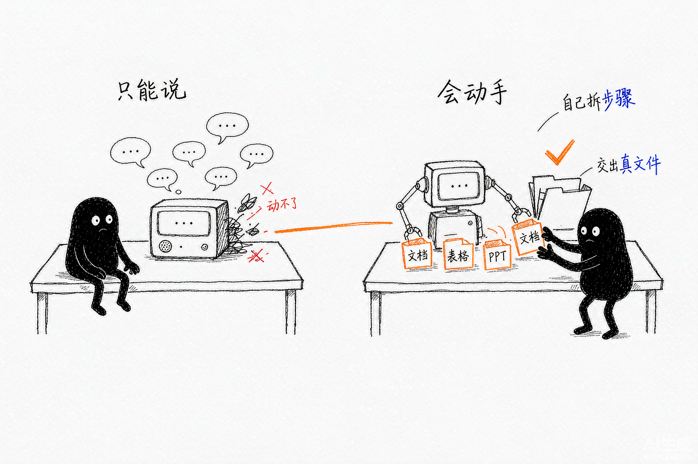

# 第 1 章 初识 WorkBuddy

> 内容来源：WorkBuddy 官方指南（非官方整理，© 本指南作者，保留所有权利）

你大概听过"AI 助手"很多次，但 WorkBuddy 不太一样：它不是让你去学提示词，
而是给你一个**能直接干活的工作台**。这一章用大白话讲清楚它到底是什么、
能帮你做什么、以及你该用什么样的预期去用它。

## 一、一句话说清 WorkBuddy 是什么

WorkBuddy 是一个 **AI Agent（智能体）办公工作台**：你用自然语言下任务，
它自己拆步骤、调工具、出结果。常见工具包括写代码、读文件、上网查资料、
连外部服务（邮箱、文档、数据库等）。

**和"聊天机器人"的区别**：聊天机器人主要陪你聊；WorkBuddy 能**动手**——
改文件、跑脚本、发邮件、生成文档，并把结果落到你的电脑或云端。

*配图为示意插画，用于帮助理解两者的区别，与实际软件界面无关。*

## 二、它能帮你做的 4 类事

| 类型 | 举例 | 你得到的 |
|---|---|---|
| 写东西 | 写周报、改文案、出方案 | 一份可直接用的文档 |
| 处理文件 | 整理桌面、批量重命名、提取表格 | 干净的文件系统 / Excel |
| 联网办事 | 查资料、盯资讯、填表单 | 汇总好的信息或已完成的动作 |
| 自动跑 | 每周一发周报、每天抓新闻 | 不用你操心，到点出活 |

## 三、第一次打开，你会看到什么

WorkBuddy 的工作界面主要由四个区域组成：**顶部工具栏**（关于、编辑、窗口等
常用操作入口）、**左侧边栏**（任务列表，按文件夹分组，底部是用户头像）、
**中间对话区**（核心交互区，含任务标题栏、消息列表和输入框）、**右侧结果区**
（提供概览与产物两类内容，可在同一区域切换查看）。

*此图片来自官方。*

你大部分时间都在"新建任务 → 描述需求 → 看它执行 → 收结果"这个循环里。
**侧边栏、对话区、结果区**这三个词后面会反复出现，先记住它们各自管什么：

| 区域 | 你在里面做什么 |
|---|---|
| 侧边栏 | 找以前的任务、管理工作空间 |
| 对话区 | 提需求、看它干活、追问补充 |
| 结果区 | 收文件、看改动、预览网页 |

## 四、新手最常见的 3 个预期误区

1. **"它什么都能做"** —— 不能。它擅长有明确输入输出、能拆步骤的任务；
   纯创意拍板、需要真人担责的事，它只能辅助。
2. **"说一句就行"** —— 说清楚"要什么 + 给什么 + 交付成什么样"三要素，结果才好。
3. **"出错就废了"** —— 它可以回滚、重试、分步确认；把大任务拆小，风险可控。

## 五、本章任务清单（做完就算过关）

- [ ] 能用自己的话解释 WorkBuddy 和聊天机器人的区别
- [ ] 想好你第一个想让它帮你做的任务是什么
- [ ] 打开软件，认出左侧导航栏、对话区、结果区三个区域

---

## 小白说明书

> 这一章出现了几个容易卡住的词，这里补一句人话解释，看不懂可以跳过正文直接看这里。

**AI Agent（智能体）**
"代理"的意思是**替你去做事**。普通 AI 聊天工具是"你问它答"，Agent 是
"你交任务，它自己拆步骤、去执行、给你结果"。区别在于它会**主动调用工具**
——读文件、跑代码、连网、操作你的电脑，而不只是输出文字。

**工作台**
这里指一个**装在电脑上、能真正碰到你文件的软件**。不是网页版那种
关掉就没了的东西，你的文件处理都在本地完成。

**自然语言**
就是**人话**。你不需要学什么专业指令或代码语法，用平时说话的方式交代任务就行。

**提示词（Prompt）**
你给 AI 的那段话。说得越具体（要什么、给什么、交付成什么），它越不容易猜错。
但 WorkBuddy 的思路是**你把目标讲清就行，不用自己拆步骤**。

**工具调用（Tool Call）**
AI 自己"伸手"去操作外部东西的动作。比如打开一个 Excel 文件、读一个网页、
跑一段脚本。这个过程你能看到，它会一步一步打出来告诉你。

**结果区 / 产物**
"产物"就是它做完之后**交付给你的东西**：文档、表格、PPT、报告、图片。
"结果区"是放这些东西的地方，在界面右侧。

**云端**
指网络上的服务器。"结果落到云端"就是把文件传到网上，换台电脑也能打开。
WorkBuddy 支持传到云端网盘、腾讯文档等地方。

**回滚**
**撤销、恢复到之前的版本**。它改错了可以退回去，不用担心一错到底。
做重要文件的任务时，这个能力很关键。

**预期误区**
指新手容易想错的地方。比如以为"它什么都能做"就是一种典型误区——
提前知道这些坑，能少走很多弯路。

---

*下一篇：第 2 章 下载、安装、登录与更新——把它装到你的电脑上。*
