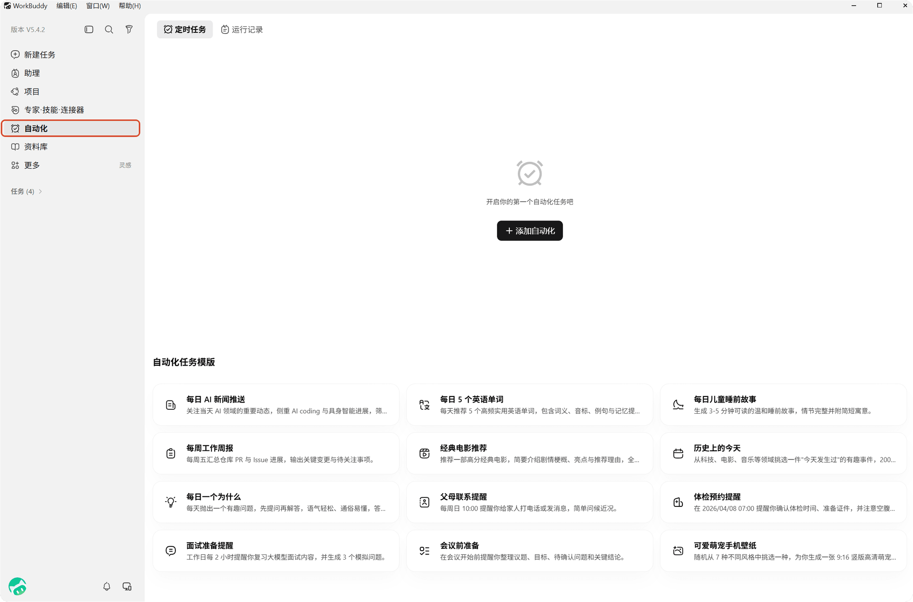
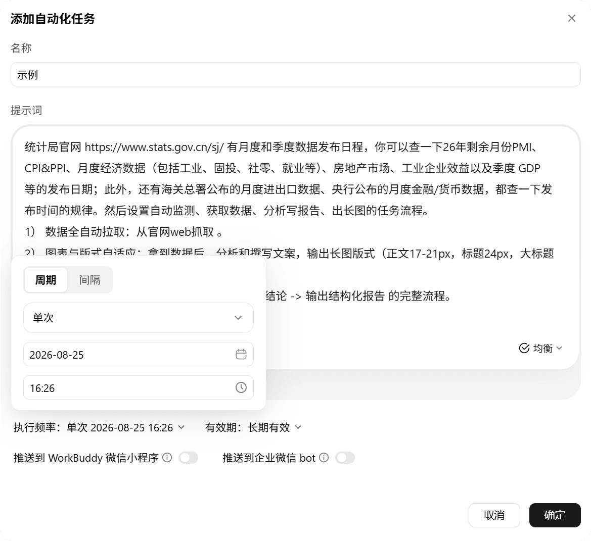
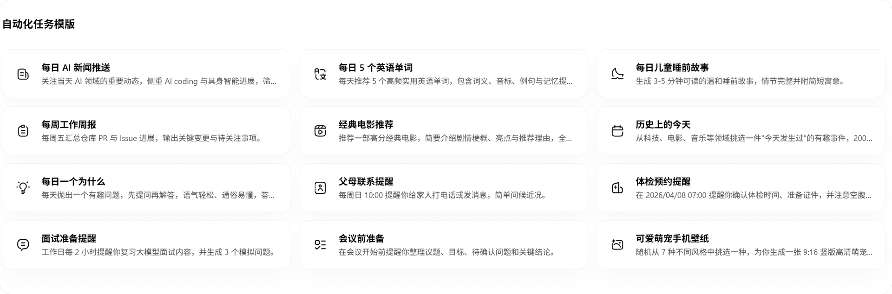
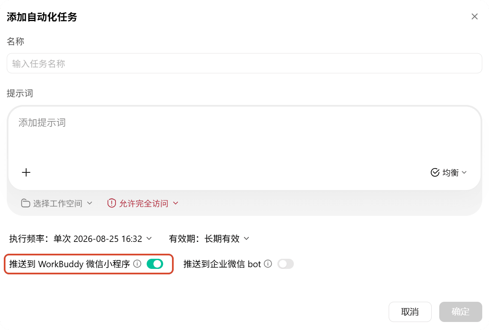
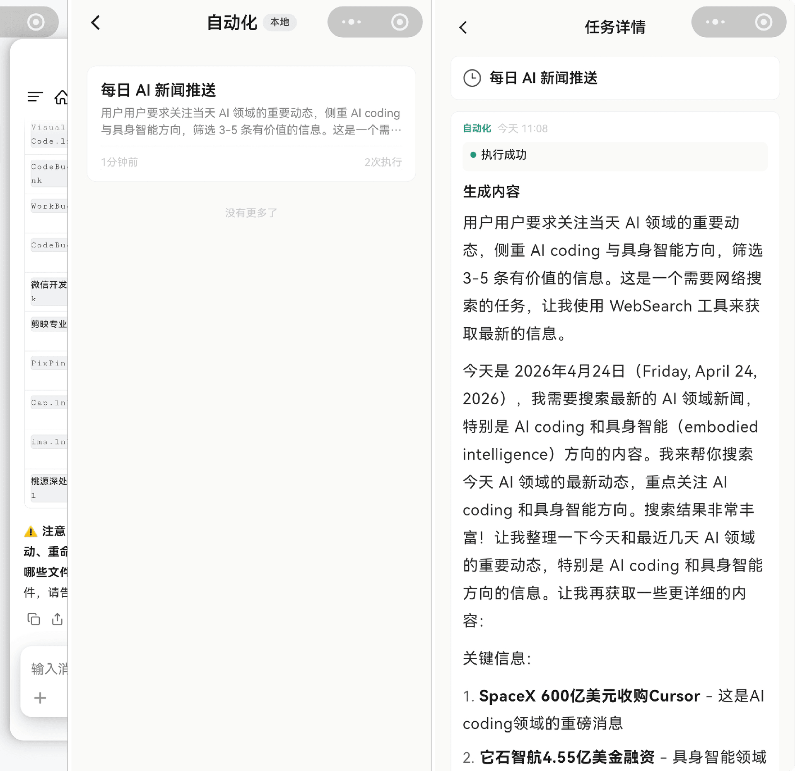
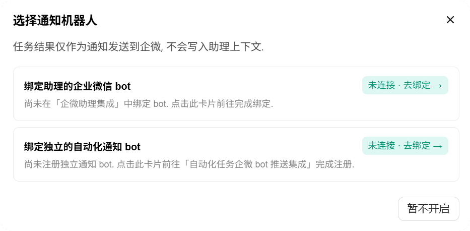
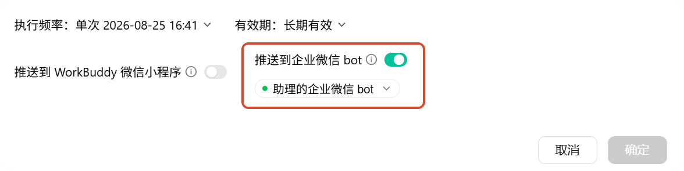

# 第 10 章 自动化任务

> 内容来源：WorkBuddy 官方指南 · 自动化（非官方整理，© 本指南作者，保留所有权利）

前九章的任务都需要你亲手点"发送"。这一章让 WorkBuddy 学会**自己上闹钟**：每天早上的 AI 新闻简报、每周五的工作周报、每月 1 号的数据整理——设定一次，到点自动执行，结果直接送到你手机上。

这就是**自动化**：给 AI 配一个不会睡过头的闹钟。

## 一、什么是自动化

官方定义拆成人话：

- 你在**本地客户端**保存一份定时任务配置（任务名、提示词、执行时间等）；
- 到了设定时间，WorkBuddy 会**以你当前登录的身份**自动发起一个 Agent 任务；
- 它按提示词执行查询、汇总、文件处理等工作，结果保存到指定目录；
- 任务只在配置的时间规则触发时执行，受频率、最大执行时长与并发控制限制。

*配图为示意插画，用于帮助理解定时执行，与实际软件界面无关。*

## 二、打开自动化页面

左侧导航栏点**「自动化」**。页面里可以查看已安排的任务和历史执行记录；底部是官方预置的**自动化任务模板**。

*此图片来自官方。*

## 三、创建第一个自动化任务

点**「添加自动化」**，填写配置项：

| 配置项 | 填什么 | 白话解释 |
|---|---|---|
| **名称** | 比如「每日 AI 新闻推送」 | 给任务起个能认出来的名字 |
| **提示词** | 任务目标和输出要求 | 它到点后照着这段话干活 |
| **工作空间** | 默认自动分配 automation-xxxx | 任务在哪个目录干活、文件存哪 |
| **权限模式** | 默认权限 / 完全访问权限 | 控制它执行时能动多少东西 |
| **模型和技能** | 指定模型、技能、专家、连接器 | 干活用哪套班子 |
| **定时规则** | 执行频率 + 生效日期区间 | 什么时候跑 |
| **推送到小程序/企微** | 开关 | 结果要不要送到手机 |

*此图片来自官方。*

**权限模式怎么选**：默认权限更安全，日常汇总、写报告够用；只有确认任务必须读写更大范围（比如整理整盘文件）时，才用完全访问权限——毕竟它是无人值守在跑。

## 四、不想写提示词？从模板开始

自动化页面下方有官方模板：每日 AI 新闻推送、每周工作周报、体检预约提醒、每日英语单词、会议前准备……点开就能用，按需改。

*此图片来自官方。*

推荐第一次就从「每日 AI 新闻推送」改起：模板的提示词已经写好"筛选 3–5 条有价值的信息"，你只需要换成自己关心的领域。

## 五、定时规则怎么设

这里有个官方专门强调的点：

- 支持**每周多天**：比如"每周一、三、五 09:00"——**一条规则就能表达**；
- 支持**每月多天**：比如"每月 1 日、15 日、28 日 09:00"；
- 同一任务的多个执行日期，请**合并在一条规则**里，**不要拆成多个自动化任务**。

为什么？拆成三个任务就是三份配置、三次触发记录，改一次提示词要改三处。一条规则，改一处就够。

「有效期」也不难懂：想让任务只跑某段时间（比如整个项目周期），设起止日期；不设就是长期有效。

## 六、让结果主动来找你：推送到小程序和企业微信

任务跑完了，人可能不在电脑前。两个推送开关就是干这个的。

**推送到 WorkBuddy 微信小程序**：打开开关（在添加任务弹窗底部），任务完成后结果自动发进小程序，手机上直接看。

*此图片来自官方。*

*此图片来自官方。*

**推送到企业微信 bot**：打开「推送到企业微信 bot」开关后会弹出选择，两种来源二选一：

| 来源 | 说明 | 适合 |
|---|---|---|
| 助理的企业微信 bot | 复用第 8 章「企微助理集成」的通道 | 已绑定企微助理的用户 |
| 独立的自动化通知 bot | 单独注册，与助理消息互不影响 | 只想收通知的场景 |

*此图片来自官方。*

*此图片来自官方。*

三个细节值得记住：

- 绑定助理 bot 时建议用 **WebSocket 长连接**——URL 回调有时效性风险，长时间不触发可能失效（界面会以 ⚠ 提醒）；
- 通道解绑时，推送开关**不会**自动关闭，界面上会出现红点提示重新绑定；
- 用助理 bot 推送的结果**只作通知**，不会写进助理的对话上下文——它不会"记得"这次任务。

## 七、安全提醒：它在你睡觉时也在干活

自动化是全书里唯一**无人值守**运行的功能，官方的提醒原样搬给你：

- **审慎设置涉及文件写入、删除、资金操作的提示词**——不确定的指令，别让它定时跑；
- 新任务先**用低频率试运行**，确认理解没问题再放大频率；
- 对涉及文件改动、数据变更、对外发送的结果，**保留可追溯的日志**；
- 积分消耗视任务复杂度：简单提醒很低，代码巡检、文档汇总这类可能消耗较多。

## 本章任务清单

- [ ] 打开左侧「自动化」页面，浏览一遍任务模板
- [ ] 从模板创建你的第一个自动化任务（建议「每日 AI 新闻推送」）
- [ ] 设置一条"每周多天"的定时规则，注意合并在一条规则里
- [ ] 打开「推送到 WorkBuddy 微信小程序」，手机上收到第一次结果
- [ ] （可选）为任务设置到期日期，学会用「有效期」控制任务寿命

## 小白说明书

> **自动化**：到点自动执行任务的定时功能。配置一次，按规则反复跑。
>
> **触发**：到了设定时间，任务自动开始执行的那一刻。
>
> **权限模式**：限制无人值守任务能"动"多少东西的开关。默认权限更安全。
>
> **工作空间**：任务执行时所在的文件夹。自动化默认分配 automation-xxxx 目录。
>
> **生效日期区间**：任务只在起止日期内运行，过期自动不跑。
>
> **推送**：任务完成后把结果发到小程序或企业微信，不用守在电脑前。
>
> **无人值守**：没有人盯着、自动运行的状态。所以涉及删文件、花钱的提示词要格外谨慎。

---

*下一篇：课外阅读——一章看懂 AI 工作系统，把前十章串成完整拼图。*

*本指南为第三方非官方整理，版权归作者所有，转载请注明出处。*
