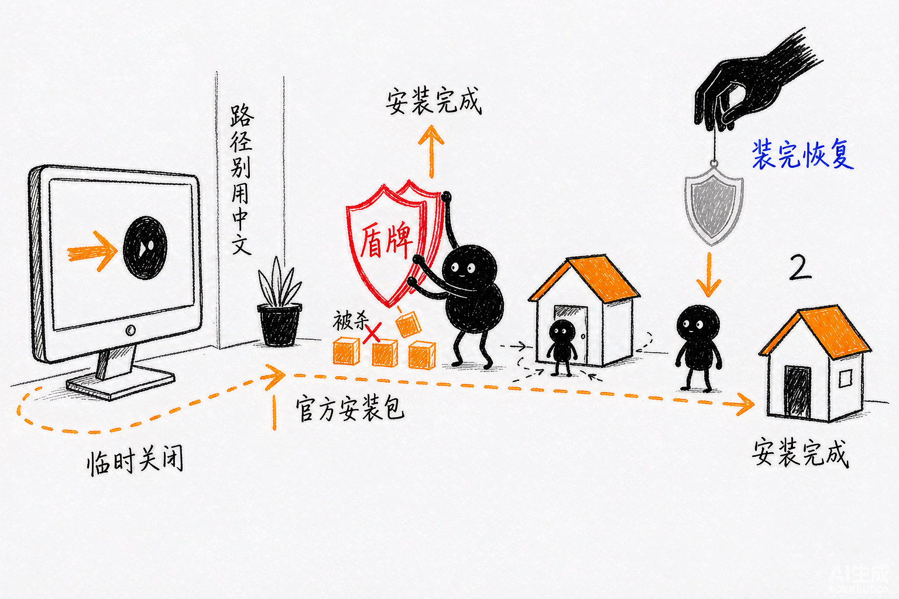

# 第 2 章 下载、安装、登录与更新

> 内容来源：WorkBuddy 官方指南 + 官方安装流程（非官方整理，© 本指南作者，保留所有权利）

上一章你知道了 WorkBuddy 能干什么。这一章把它装到电脑上——从下载到登录，
全程大约 10 分钟。这一章的目标很单纯：**装完、登进去、确认能用**。

## 一、先看硬件要求，别装完才发现带不动

| 项目 | 要求 |
|---|---|
| 操作系统 | Windows 10 及以上 / macOS 12 及以上 |
| 内存 | 建议 8GB 以上 |
| 硬盘剩余 | 至少预留 3GB（含后续缓存） |
| 网络 | 稳定即可，安装包约 150–180MB |

**为什么强调这个？** 安装包本身不算大，但 WorkBuddy 会在本地缓存文件、
生成中间产物。磁盘空间太紧的话，运行到一半报「空间不足」，比装不上更闹心。

## 二、下载：从官网拿，别从搜索结果里随便点

**正确做法**：浏览器打开 WorkBuddy 官网首页，页面会自动识别你的系统
（Windows 或 macOS），点「下载 WorkBuddy」按钮即可。

**为什么要认准官网？** 市面上模仿官方界面的下载站不少，装到非官方包，轻则
捆绑一堆无关软件，重则装到坏东西。认准官网是唯一有效的防护。

**顺手核对文件名**：下载完成后，确认安装包名称与官方一致。Windows 一般是
`WorkBuddySetup.exe`，macOS 是 `WorkBuddy.dmg`。名字不对就别装，重新去官网下。

## 三、Windows 安装：7 步

1. 双击 `WorkBuddySetup.exe`，启动安装向导。
2. 弹出「用户账户控制」询问是否允许更改设备，点**「是」**。
3. 阅读许可协议，勾选「我同意此协议」，点「下一步」。
4. **选择安装路径**。默认路径在 C 盘的 `AppData` 目录里。
   **建议点「浏览」改到 D 盘或 E 盘**——C 盘留给系统和微信这类常用软件更划算。
5. 确认开始菜单文件夹，保持默认，点「下一步」。
6. **勾选「创建桌面快捷方式」**，下次双击桌面图标就能启动。
7. 点「安装」，等进度条走完（大约 30 秒到 1 分钟），完成后点「完成」。

> 想省事的读者直接用默认路径也能跑，只是长期用会占系统盘空间。

## 四、macOS 安装：3 步，注意"无法验证开发者"

1. 双击 `WorkBuddy.dmg` 文件。
2. 把 WorkBuddy 图标**拖进「应用程序」文件夹**。
3. 首次打开时，如果系统弹出「无法验证开发者」，这是 macOS 的正常机制
   （因为没有走付费的苹果开发者认证）。处理办法：
   打开**系统设置 → 隐私与安全性 → 通用**，在底部找到提示，点**「仍要打开」**，
   再确认一次即可。之后就不会再拦了。

## 五、一个坑：杀毒软件可能把官方安装包误判成风险程序

这是新手安装失败最集中的原因。表现是：解压中途文件被删、安装到一半失败、
装完打不开。

**WorkBuddy 是腾讯官方认证的软件，本身没有病毒。** 遇到这种情况，
在安装前临时关闭第三方杀毒软件和系统防火墙的拦截，装完立刻恢复防护即可。

*配图为示意插画，用于帮助理解拦截环节，与实际软件界面无关。*

**排查顺序**（先做第 1 步，做完再考虑第 2 步）：

1. 先检查安装路径里有没有**中文、空格或特殊字符**——这是第二大原因。
2. 路径没问题，再临时关闭防护试一次。

## 六、首次登录：三选一

装完后会自动弹出登录界面，支持：

| 方式 | 说明 |
|---|---|
| 微信扫码 | 最顺手，手机扫一下就进去了 |
| QQ 扫码 | 已有 QQ 账号的话同样快 |
| 腾讯云账号 | 用腾讯云账号体系登录 |

用哪个都行。**扫码确认后会自动注册，并获得 5000 Credits 的初始额度。**

## 七、别漏了文件夹授权（这是设计，不是 Bug）

登录后你可能会看到一个要求授权文件夹的提示。**这是安全设计，不是权限问题**——
WorkBuddy 不会偷偷翻你全盘文件，它只在你明确授权的目录里干活。

建议授权一个专门的工作文件夹（比如新建一个 `WorkBuddy` 目录），
而不是直接授权整个「文档」或「桌面」。原因很简单：授权范围越小，
它越不容易碰到你不想动的东西，出错时清理也简单。

## 八、更新怎么弄

WorkBuddy 客户端一般会**自动检查更新**，有新版本会在界面上给出提示。
你也可以在设置里手动检查。

**为什么要及时更新？** 官方迭代很快，新功能（比如某个专家、某个连接器）
经常是先在新版本里落地。旧版本看不到新功能，会以为是「这功能没有」。

## 九、本章任务清单（做完就算过关）

- [ ] 从官网下载了安装包，文件名核对无误（`WorkBuddySetup.exe` / `WorkBuddy.dmg`）
- [ ] 安装完成，桌面出现 WorkBuddy 快捷方式
- [ ] 成功登录（扫码或账号），看到主界面
- [ ] 授权了一个专门的工作文件夹（不是整个桌面）
- [ ] 知道安装失败时先查「路径是否含中文空格」

---

## 小白说明书

> 这一章出现了几个容易卡住的词，这里补一句人话解释，看不懂可以跳过正文直接看这里。

**安装包 / 安装向导**
下载下来的那个 `.exe` 或 `.dmg` 文件就是「安装包」，双击它之后弹出来的那一
步步界面就是「安装向导」。它只是把你确认几件事、复制几个文件，没有多复杂。

**用户账户控制（UAC）**
Windows 的安全机制。装任何软件它都会弹出来问「是否允许此应用对你的设备进行
更改」，点「是」就行。这个弹窗是**系统的常规行为，不是中毒信号**，可以放心点。

**「无法验证开发者」（macOS）**
苹果要求付费开发者认证后才能免掉这个提醒。WorkBuddy 没走这个付费认证，
所以第一次打开会被拦。**这不是盗版也不是病毒**，按正文第四节的路径点
「仍要打开」就永久解决了。

**AppData**
C 盘里的一个隐藏文件夹，存放「这个用户的应用数据」。很多软件默认装在这儿，
软件本身不大但越攒越多。建议改到 D 盘就是为了给 C 盘减负。

**Credits**
WorkBuddy 内部使用的额度单位。可以理解成「AI 的工作点数」——你下的任务越多、
任务越复杂，消耗的点数越多。首次登录赠送 5000，够你用相当长一段时间。

**文件夹授权**
你告诉 WorkBuddy「哪些目录你可以动」。它**只能**在你授权的目录里读写文件，
没授权的一律碰不到。所以授权范围越小越安全——这是保护你的机制，不是限制。

**系统防火墙 / 杀毒软件拦截**
安全软件有时会把没见过的程序当成可疑对象，误拦或误删。WorkBuddy 是腾讯官方
认证的软件，可以放心放行；装完记得把防护重新打开。

---

*下一篇：第 3 章 主界面、任务与工作区——带你把左边那条导航栏彻底认熟。*
