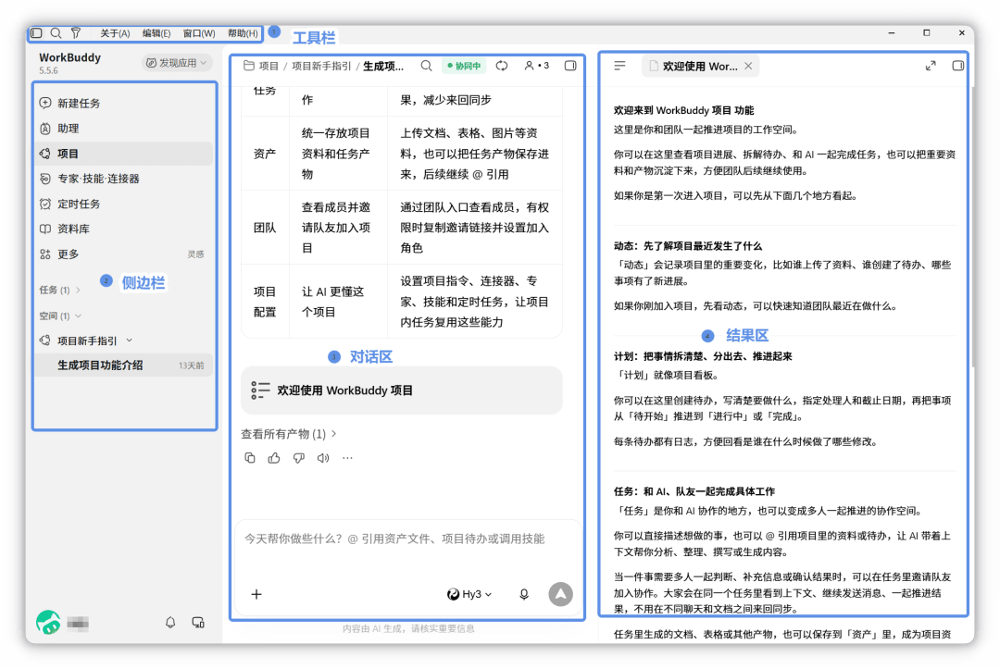
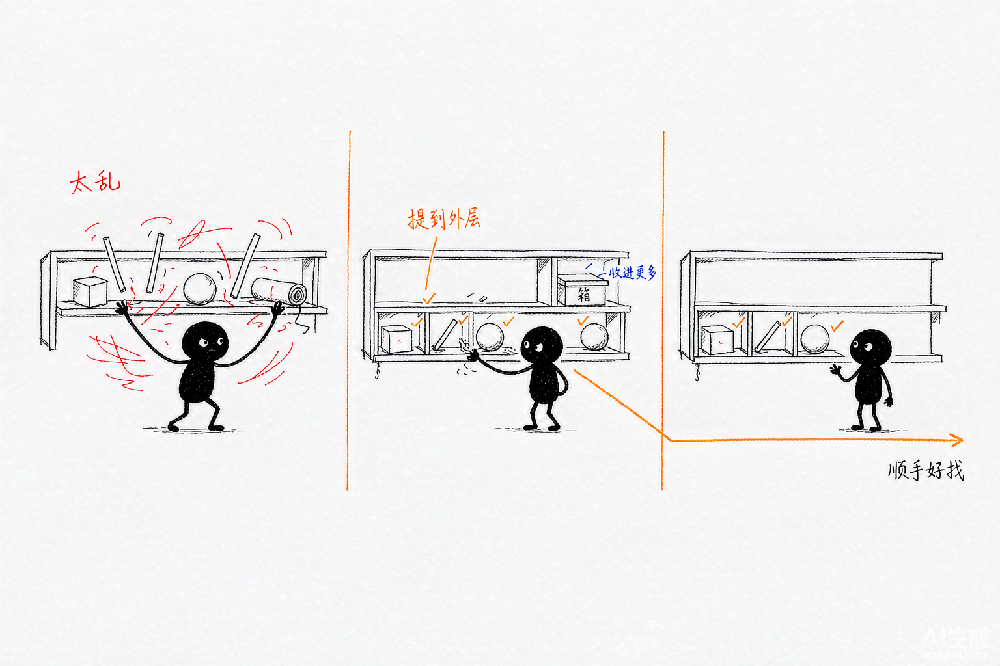

# 第 3 章 WorkBuddy 的主界面、任务与工作区

> 内容来源：WorkBuddy 官方指南 · 左侧导航栏（非官方整理，© 本指南作者，保留所有权利）

很多新手打开 WorkBuddy 第一眼会懵：左边一条竖排图标，点哪个都不知道干嘛。
这一章带你把**最左边那条导航栏**彻底搞清楚。它是你所有操作的"总入口"，
搞懂它，后面 90% 的功能你都能自己找到。

## 一、先看懂：导航栏长什么样

导航栏从上到下分成 4 块，记住这个顺序就够了：

| 区域 | 里面有什么 | 白话解释 |
|---|---|---|
| 顶部 | 版本号、「发现应用」 | 看当前版本，顺手发现新应用 |
| 一级入口 | 新建任务、助理、项目、专家·技能·连接器、自动化、资料库、更多 | 主力功能，点这里进对应页面 |
| 任务与空间 | 任务、空间 | 你做过的历史任务、工作区列表 |
| 底部 | 消息中心、多端协同、账号头像 | 消息、设备、账号设置 |

**为什么先讲这个？** 因为后面每章教的功能（比如"怎么用技能""怎么连连接器"），
第一步永远都是"在左边导航栏点 XXX"。你先把入口认熟，后面不用回头找。

*此图片来自官方。*

## 二、一级入口逐个认（这是你每天都会用的）

- **新建任务**：开启一个本地 AI 工作台，绝大多数活从这里开始。
- **助理**：云端助理，可以远程接任务、给你推消息（不在电脑前也能干活）。
- **项目**：按项目把任务归类，支持团队协作。
- **专家·技能·连接器**：这是"能力中心"——调专家、装技能、连外部服务，后面案例篇重点讲。
- **自动化**：设定时任务，让 WorkBuddy 按计划自己跑（比如每周一发周报）。
- **资料库**：文档、表格、网页等资料的统一收纳处。
- **更多**：低频入口的"收纳盒"——我的邮箱、腾讯文档、ima、乐享知识库、灵感、Genie BaaS。

> 小提示：入口多了以后，常用的留外面，不常用的收进「更多」，每天少点好几下。

## 三、动手做：把导航栏调成你顺手的样子

官方允许你自己排菜单顺序。跟着做一遍：

1. 在左侧导航栏**任意位置点右键**。
2. 在右键菜单里点 **「自定义菜单」**，会弹出自定义面板。
3. 面板里有「一级菜单」和「更多」两组：
   - **组内排序**：按住条目右边的手柄上下拖，改同一组里的先后。
   - **跨组移动**：把条目拖到另一组，就能在"一级菜单"和"更多"之间切换。
4. **「新建任务」是固定项**，不能拖，也不能收进「更多」（它是你的主入口，得一直在）。
5. 拖完**不用点保存**，面板和导航栏同时可见，即时生效；关掉面板配置也会留着，重开客户端还是你排的顺序。

*配图为示意插画，用于帮助理解整理菜单的思路，与实际软件界面无关。*

**做完的样子**：你把"新建任务、助理、项目"放一级，剩下的塞进「更多」，
下次打开 WorkBuddy，最常用的三个一眼就能点到。

## 四、一个坑：自定义只存在这台电脑上

你调好的顺序**只保存在当前设备**，目前不跨设备同步。
换一台电脑登录，导航栏会按那台电脑自己的设置显示——不是你之前调的。

**应对**：公司/家里两台电脑都用的话，各自调一次；或者把常用功能都放一级菜单，
减少依赖顺序。

## 五、本章任务清单（做完就算过关）

- [ ] 能说出导航栏 4 块分别是什么
- [ ] 打开「自定义菜单」，把 3 个常用功能拖到一级
- [ ] 确认「新建任务」无法被收进「更多」

---

## 小白说明书

> 这一章出现了几个容易卡住的词，这里补一句人话解释，看不懂可以跳过正文直接看这里。

**导航栏 / 侧边栏**
界面**最左边那条竖着的菜单栏**。软件的所有功能入口都在这里，
点某个图标就进对应页面。文中"导航栏"和"侧边栏"说的是同一个东西。

**一级菜单 / 一级入口**
菜单的**最外层**，直接能点到的那些项。往里还有「更多」这种收纳项，
要点进去才能看到里面的东西。把常用的放一级，是为了少点一次。

**「更多」**
一个**收纳盒**。低频、不常用的功能会被收在这里，避免主菜单塞太满。
点开它才能看到里面的条目。

**自定义菜单**
官方提供的**调整菜单顺序和分组**的功能。改完即时生效，不用保存按钮，
关掉面板设置也留着。

**跨组移动**
把一个菜单项从「一级菜单」**拖到「更多」**，或者反过来。
拖完之后它就在不同的层级上了。

**固定项**
指**不能被移动或隐藏的菜单项**。这一版里只有「新建任务」是固定项——
它是主入口，必须一直在。

**消息中心**
放系统通知和消息的地方，比如任务完成了、更新了之类的提醒。

**多端协同**
指**多个设备一起用**。比如电脑上开的任务，手机端也能接。

**跨设备同步**
指**在 A 电脑做的设置，B 电脑上自动也有**。这一版的自定义菜单**不支持**跨设备同步，
所以两台电脑要分别设置。

**工作空间（Workspace）**
一个**工作目录**。导航栏里的「空间」就是它的入口——把相关任务归到一个空间里，
方便集中管理。第 4 章会讲怎么在任务里选工作空间。

---

*下一篇：第 4 章 快速完成第一个 WorkBuddy 任务——用刚才认识的「新建任务」真做一件事。*
