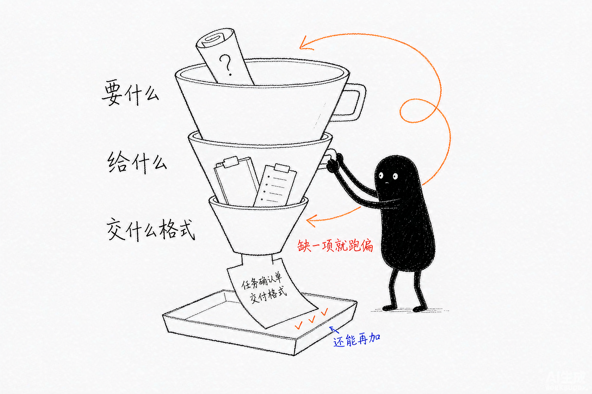
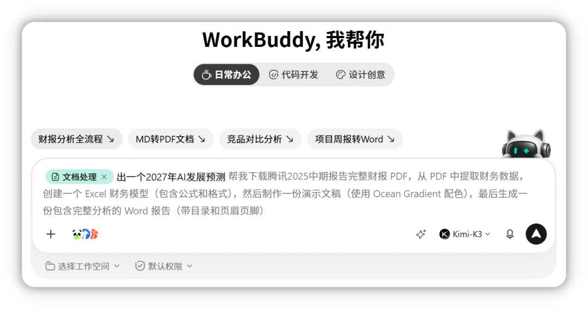
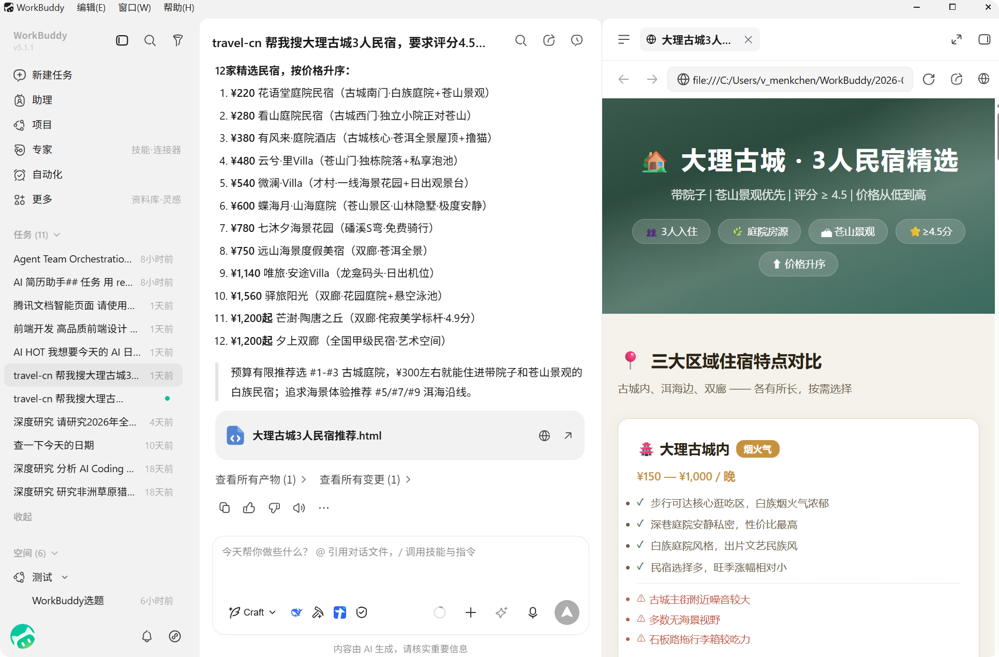
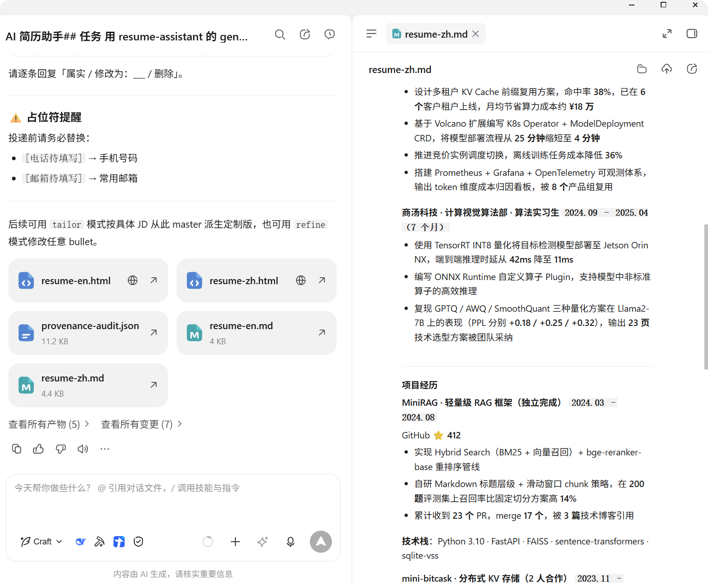
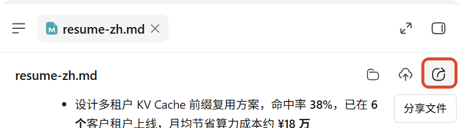
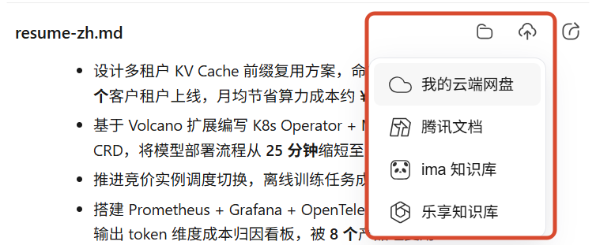
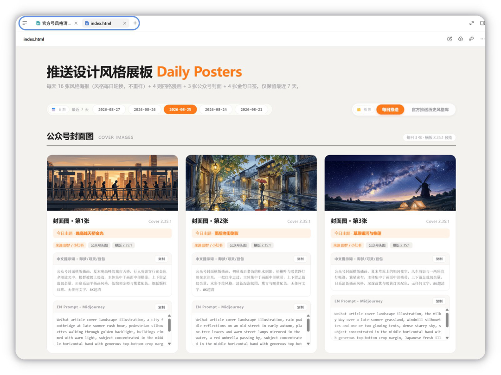
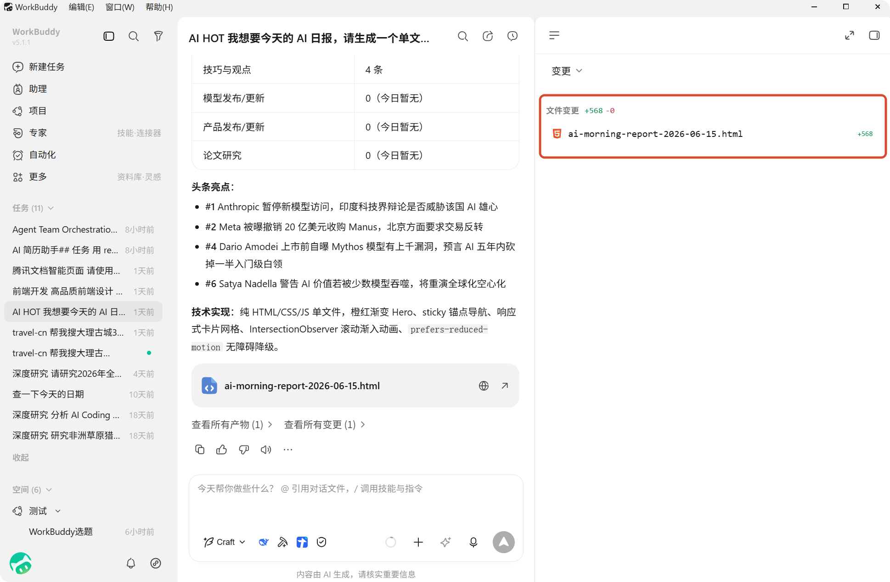

# 第 4 章 快速完成第一个 WorkBuddy 任务

> 内容来源：WorkBuddy 官方指南 · 创建任务 / 任务管理 / 结果查看（非官方整理，© 本指南作者，保留所有权利）

前面两章你已经装好软件、认清了导航栏。这一章真正动手——**跑通你的第一个任务**。

这一章最重要的不是"让它做出多厉害的东西"，而是**跑通一次完整闭环**：
提需求 → 看它干活 → 收到结果 → 验收。走通这一遍，后面所有章节都是这个
闭环的变体。

## 一、创建任务：三种方式任选

在左侧导航栏点**「新建任务」**，会进入创建任务页。你可以从三个入口开始：

| 方式 | 怎么做 | 适合谁 |
|---|---|---|
| 直接说人话 | 在输入框写一句话需求 | 第一次用，先试试水 |
| 用提示词模板 | 悬停在模板上看预览，合适就点 | 不知道怎么组织需求 |
| 从任务列表继续 | 打开旧任务补一句 | 上次没做完，想接着来 |

**重点提醒**：官方文档明确说了 WorkBuddy 的核心优势是理解自然语言，
**你不需要预先把任务拆成步骤**。把"要什么结果"讲清楚就够了，拆步骤是它的事。

*此图片来自官方。*

## 二、把需求说清楚的公式：要什么 + 给什么 + 交付成什么样

这是本节最该记住的一段。新手最容易犯的错是只说一句"帮我整理一下"，
然后抱怨它理解错了。

| 要素 | 反面例子 | 正面例子 |
|---|---|---|
| **要什么** | 整理一下文件 | 按类型把这批照片分类整理好 |
| **给什么** | （没说） | 桌面「测试文件夹」里的 10 张图 + 3 个 PDF |
| **交付成什么样** | （没说） | 图片放「图片」子文件夹，PDF 放「文档」子文件夹 |

*配图为示意插画，用于帮助理解三要素的关系，与实际软件界面无关。*

官方给的示范句式，可以直接套用：

- "帮我把这份销售数据生成一个分析报告，包含图表"
- "整理 Downloads 文件夹里的图片，按日期分类"
- "根据这份会议纪要生成一个 PPT"
- "分析这份简历，提取关键信息生成表格"
- "调研一下 2024 年 AI 行业趋势，写一份报告"

**看出规律了吗？** 每句都包含了目标动作 + 明确的输入来源 + 期望的输出形态。
照这个结构写，结果就可控了。

## 三、四种补充上下文的方式（让需求更精准）

除了写清楚需求，你还可以给它更多"背景资料"：

| 方式 | 操作 | 白话解释 |
|---|---|---|
| **引用上下文** | 输入 `@` 引用文件、文档、规则 | 明确告诉它"参考这个" |
| **粘贴截图** | `Ctrl/Cmd + V` 直接粘贴 | 你看到什么它就看到什么 |
| **上传文件** | 点上传按钮，或直接拖文件进输入框 | 把素材递给它 |
| **补充说明** | 在描述里写清目标、范围、约束 | 划定边界，别让它跑偏 |

**优先补这四类信息**：目标是什么、输入是什么、输出格式（Word/Excel/PPT）、
约束条件（风格、字数、截止时间）。

### 提示词模板的妙用：灰字只是预览，不会被你误发

创建任务页按场景（日常办公、代码开发、设计创意）提供了一组提示词模板。
**把鼠标悬停在模板上，输入框会即时显示灰色预览文案**，你可以先看清内容再决定要不要用。

这里有个新手常误会的地方，官方文档专门强调过：

> - 灰字**仅供预览**，不会进入草稿、撤销记录，**也不会被发送**；
> - 输入框已有文字时，预览接在已有内容末尾，黑色原文保持不变；
> - 移开鼠标、失去焦点或切换场景后，预览自动清除；
> - **确认合适后点击模板**，才会真正填入输入框。

所以你可以放心地一个个悬停过去比对，不满意的一概不会留在框里。

*此图片来自官方。*

## 四、选择工作空间：告诉它"在哪个目录干活"

输入框左下角有**「选择工作空间」**，点它选一个目录。选定后，WorkBuddy
会**基于该目录读取和处理文件**。

不选也行 —— 它会在默认目录里生成结果。但如果你要做的事跟某个具体文件夹有关
（比如"整理我的下载目录"），**选对工作空间能省掉很多纠偏沟通**。

## 五、任务创建成功后会发生什么

点下发送，任务就建好了。你会看到：

1. **新任务出现在左侧任务列表里**
2. **对话区持续展示它的执行过程**——它会把每一步在干什么打出来给你看
3. **右侧结果区按任务类型展示产物、全部文件、变更和预览**
4. **可以继续补消息，也可以同时建别的任务并行推进**

## 六、看结果：右侧结果区的四类内容

结果区集中在一块区域，方便你来回切换对照：

| 类型 | 看什么 | 什么时候重点看 |
|---|---|---|
| **概览 → 工作空间文件** | 当前工作空间里的文件内容 | 想确认它有没有写错位置 |
| **概览 → 浏览器** | 网页或可直接打开的结果页面 | 它做的是网页/原型时 |
| **概览 → 变更** | 本次任务带来的文件修改 | **代码、脚本、配置类任务必看** |
| **产物** | 生成的文档、表格、PPT、报告 | 交付前最后确认 |

*此图片来自官方。*

任务跑完后，对话区下方会列出这次产出的所有文件，右侧可以直接预览内容：

*此图片来自官方。*

### 产物的分享与上传

预览产物时点右上角的分享图标可以直接分享；也支持上传到
**我的云端网盘、腾讯文档、ima 知识库、乐享知识库** —— 在其他端的
WorkBuddy 应用内也能查看。

*此图片来自官方。*

*此图片来自官方。*

### 做了网页？内置浏览器直接看

如果任务生成的是网页、页面原型或本地启动的 Web 应用，内置浏览器里
能直接看效果，还会提供页面地址、刷新入口。产物栏支持**同时开多个浏览器页签**
（导航栏右侧的 `+` 号新建），每个页签保持独立的浏览状态，可以来回对比。

*此图片来自官方。*

**一个实用建议**：接受结果前先点一遍「变更」。如果任务涉及代码开发、脚本生成
或配置调整，这一步能帮你在结果落到文件之前就发现问题。

*此图片来自官方。*

## 七、任务状态：知道它在干什么，也知道什么时候该介入

左侧任务列表的状态标记，是你判断"要不要管它"的依据：

| 状态 | 含义 | 你该做什么 |
|---|---|---|
| **进行中** | 正在执行 | 等 |
| **已完成未读** | 做完了，你还没看结果 | **去看结果** |
| **待确认** | 停下来等你确认或补充信息 | **去回应它** |
| 规划中 | 正在分析需求、整理思路 | 等 |
| 失败 | 执行中出问题 | 看报错，补信息重试 |
| 已归档 | 已归档，供查阅 | 不用管 |

分组收起时，需要关注的状态会**聚合显示在分组标题右侧**，只显示优先级最高的那个，
优先级是：**待确认 > 已完成未读 > 进行中**。点它可以直接跳到第一个待处理的任务。

**"待确认"这个状态最值得注意** —— 它意味着它在等你给指令，你不回，它就停在那。

## 八、结果不满意？接着聊就行，不用重来

已完成、失败或暂时中断的任务，都可以**重新进去继续补消息**。
它会**在已有上下文基础上继续推进**，不用你从头再讲一遍。

适合继续处理的三种情况：
- 第一次结果不够完整，想继续细化
- 执行失败了，补充信息后再试一次
- 想基于之前的结果扩展新需求

## 九、一个坑：删除任务无法恢复

在任务行上悬停点「⋯」或直接右键，菜单里既有删除，也有置顶、重命名、保存到
工作空间、分享任务等操作。注意区分删除的后果：

| 任务状态 | 删除后果 |
|---|---|
| 普通任务 | 从**所有设备**移除，**无法恢复** |
| 正在运行的任务 | **立即终止运行**，无法恢复 |

删除确认弹窗会直接出现在任务行旁边，键盘用 `Enter` 确认、`Esc` 取消。

**应对**：不确定的任务先「归档」而不是删除——归档后还能在
「系统设置 - 数据管理」里找到。另外如果列表里有一堆要清理的，
可以用右键「批量操作」，但**正在运行的任务无法勾选**，得等它结束或先停止。

## 十、本章任务清单（做完就算过关）

- [ ] 独立创建了一个任务，用的是"要什么 + 给什么 + 交付成什么样"的结构
- [ ] 用 `@` 引用过文件，或上传过一个文件作为上下文
- [ ] 故意悬停试了几个提示词模板，确认灰字预览不会污染输入框
- [ ] 选过工作空间，知道它默认在哪个目录干活
- [ ] 在结果区找到「产物」，确认看到了自己要的交付物
- [ ] 点过一次「变更」，看过这次任务到底改了什么
- [ ] 认得「已完成未读」和「待确认」两个状态的含义
- [ ] 知道删除不可恢复，以及"归档"是更安全的选择

---

## 小白说明书

> 这一章术语密度比较高，这里统一解释。看完正文操作没问题的话，这段可以当复读材料。

**工作空间（Workspace）**
就是"这次任务在哪个文件夹里干活"。你选定一个目录，WorkBuddy 就在这个目录里
读文件、写结果。可以理解为给 AI 指一个"工作台"。不选也能用，它会用默认目录。

**上下文（Context）**
"上下文"在这里就是**你递给它的背景资料**。同一个需求，给不给上下文，
结果质量差很多。比如你说"分析这份数据"——不指文件它不知道分析哪份，
指了它就明确了。

**`@` 引用**
一个快捷记号。输入 `@` 会弹出可选项，选中的文件/文档就"贴"到了你的需求里，
相当于明确告诉它"参考这个"。不用去翻路径打字。

**提示词模板 / 灰字预览**
模板是官方准备好的现成需求句式。**悬停时看到的灰字只是给你预览的示意**，
不会真的填进去、也不会发出去。你得**点一下模板**才真的填入。
这是官方特意设计的，防止手滑把不需要的内容发出去。

**产物**
任务做完后交付给你的东西。文档、表格、PPT、报告、图片都算"产物"。
产品说明书里的正式说法，但理解成"成果"就对了。

**变更（Diff）**
这次任务**改动了哪些文件、改了什么内容**的对照视图。改了文件的任务
（写代码、改配置、跑脚本）**接受结果前一定要看这个**，
能在结果落到文件之前就发现它改错了。

**规划中**
它还在"想"——分析需求、整理执行思路的阶段，还没开始动手。
说明白一点：这是它拆解任务的时间，不是卡住了。

**待确认**
它停下来等你回答。**这是最需要你介入的状态**，你不回话它就一直停着。
常见于它需要你选一个方案、确认某个文件、或者缺信息做不下去。

**已完成未读**
活干完了，但你还没打开结果区看。**看到图标就该去验收**，
它不会主动告诉你结果对不对。

**归档 vs 删除**
归档 = 收起来，以后还能在设置里找到。删除 = **永久消失，所有设备上都清掉，
恢复不了**。不确定就归档，别删。

**上下文管理（继续处理已有任务）**
不用重新开一个任务再讲一遍。打开旧任务补一句就行，它记得之前聊过什么，
直接在原有基础上往下做。任务失败要重试、或想扩展之前的结果，都用这招。

---

*下一篇：第 5 章 加载一个真正用得上的 Skill——把重复的活变成一条指令。*
