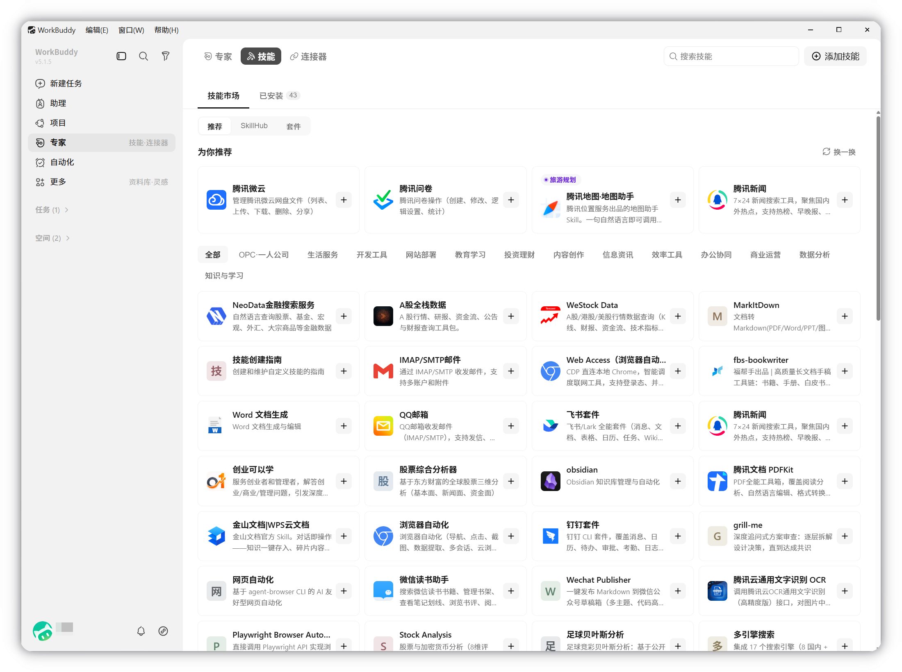
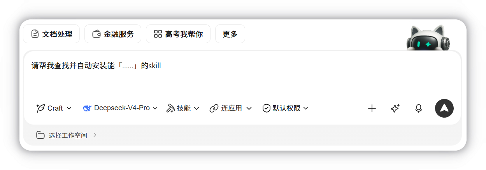

# 第 5 章 加载一个真正用得上的 Skill

> 内容来源：WorkBuddy 官方指南 · 技能（非官方整理，© 本指南作者，保留所有权利）

前四章你已经能跑通任务了。但你会发现一件事：**每次都要重新交代一遍同样的流程。**
这一章解决的正是这个问题——把一套做熟的操作装成 Skill，以后一句话就能调用。

## 一、Skill 到底是什么：给 AI 装上"工具能力"

**技能（Skill）** 为 WorkBuddy 增加「特定工具能力」——封装一组可执行的
脚本与工作流，让 AI 在你授权下完成具体动作。

听起来抽象，看几个实际的：

| Skill 能做的 | 相当于你不用再手动的 |
|---|---|
| 发送邮件 | 每次手动写收件人、正文、点发送 |
| 订外卖 | 每次翻菜单、凑单、下单 |
| 查询股价 | 每次搜代码、看盘口 |
| 读写文件 | 每次手动打开、改名、保存 |
| 调用第三方 API | 每次查文档、拼参数 |

**一句话理解**：Skill 是**把"怎么做"固化下来**，AI 照着执行就行。

*配图为示意插画，用于帮助理解技能的作用，与实际软件界面无关。*

## 二、页面概览：两个板块

技能板块分为两块：

| 板块 | 内容 |
|---|---|
| **技能市场** | 推荐技能，可按需一键安装 |
| **已安装** | 已安装的本地技能，可直接在对话中调用 |

*此图片来自官方。*

在左侧导航栏点**「专家·技能·连接器」**，默认进入**技能**页签。
右上角的**「添加技能」**按钮是安装入口，搜索框在右上角。

## 三、安装技能：三条路

点**「添加技能」**，会看到三个选项：

### 方式一：上传技能（导入本地技能包）

选**上传技能**，拖拽或点击**选择文件**，选中本地技能包即可完成导入。
导入后系统会自动完成配置，**无需额外操作**。

**什么情况用这个**：你从别处拿到了别人做的 Skill 包（通常是 `.zip` 格式）。

### 方式二：查找技能（让它帮你找）

选**查找技能**，**输入任务描述**，WorkBuddy 会自动查找相关技能。

*此图片来自官方。*

这一条对新手最有用——**你不用知道技能叫什么名字**，描述你想要什么就行。
比如"我要一个能把 Word 文档转成 PDF 的技能"，它会给你候选。

### 方式三：创建技能（让它帮你写一个）

选**创建技能**，同样输入任务描述，WorkBuddy 自动创建相关技能。

**什么情况用这个**：市面上的技能都不满足你的独特需求，那就做一个。

## 四、启用与关闭：不用卸载也能暂停

已安装的技能支持随时关闭或重新启用，**无需卸载**。

| 操作 | 效果 |
|---|---|
| **关闭** | 技能仍保留在已安装列表，但**不参与对话中的模型自动调用** |
| **重新开启** | 立即恢复 |
| **卸载** | **彻底删除**技能及其开关记录 |

官方特别强调了两个区别：

- **开关状态多端同步** —— 启用/关闭记录在你的全局配置里，**换设备也同步**
- **不改动技能原文件** —— 开关状态只记在配置里，**不会修改技能包本身的 `SKILL.md` 文件**

**官方建议**：仅启用当前任务所需的技能，减少无关干扰并降低误调用概率。
技能装多了，它可能在你不需要的时候乱用。

## 五、搜索与卸载

**搜索**：技能较多时，用右上角搜索框输入关键词快速定位。

**卸载**：需要在本机完全卸载时，选择**卸载技能**，也支持批量操作。

## 六、一个坑：第三方 Skill 可能要你的数据

官方在这一节写得很直白，建议你认真读：

> Skill 可能根据其能力与指令使用「信息收集与使用」中提到的任意数据，
> 也可能将你的输入内容发往第三方。**建议优先使用官方推荐 Skill**；
> 安装第三方 Skill 前请审慎校验来源、权限申请与脚本内容。

**可能涉及哪些信息**（视 Skill 而定）：账户身份信息、联系方式、用户输入内容、
使用行为日志、第三方平台凭证、本地文件读写、屏幕与输入控制权限。

实际范围**以你安装与启用时授权的能力为准**——同一个 Skill 在不同任务下
可能只用其中一部分。

### 安全建议（官方原文要点）

- 安装第三方 Skill 前，**仔细查看其权限申请、来源说明与脚本内容**，确认数据外发范围
- Skill 调用第三方、修改本地文件、执行系统命令时，**均以你本人身份执行**
- 涉及文件删除、批量写入、系统配置变更或资金类操作时，**建议先在小范围验证再放大使用**

### 两个必须知道的提醒

- **积分消耗**：涉及复杂任务和复杂 Skill 时，积分消耗通常较高。
- **第三方共享**：部分 Skill 会把输入内容发往第三方（订外卖、查股票、发 IM 消息等）。

## 七、本章动手：装一个你下周就用得上的

1. 点左侧**「专家·技能·连接器」→ 技能**
2. 点右上角**「添加技能」→ 查找技能**
3. 输入你真实想要的能力（比如"把文档转成 PDF""发邮件"），看它给出哪些候选
4. 装一个，先别装五个
5. 回到对话区，试着让它用这个技能干一次活
6. 完成后**关掉**它，观察是否影响别的任务

## 八、本章任务清单（做完就算过关）

- [ ] 说出 Skill 是什么（给 AI 装工具能力，把"怎么做"固化下来）
- [ ] 知道技能板块的两个部分：技能市场、已安装
- [ ] 用「查找技能」装过至少一个 Skill
- [ ] 知道关闭和卸载的区别（关闭可恢复，卸载彻底删）
- [ ] 装第三方 Skill 前会先看权限申请和来源
- [ ] 只启用当前任务需要的技能，用完就关

---

## 小白说明书

> 这一章术语密度很高，这里统一解释。

**Skill（技能）**
一个**打包好的操作手册+执行脚本**。它告诉 AI"这类活该怎么做、按什么步骤做"。
装上之后你不用再重复描述流程。类比：普通提示词是你每次口头交代一遍，
Skill 是写成了 SOP 贴在墙上。

**工具能力**
Skill 赋予的**具体动作能力**，比如发邮件、查股票。区别于"知识"——
它不是让 AI 知道得多，而是让 AI **做得到**。

**本地技能包**
一个打包好的文件（通常是 `.zip`），里面装着这个 Skill 的全部内容。
别人做好了发给你，你就用「上传技能」导入。

**上传 / 查找 / 创建**
安装 Skill 的三条路：
- **上传** = 你已经有了包，导入
- **查找** = 你说需求，它帮你找现成的
- **创建** = 现成的都不行，让它帮你写一个

新手用得最多的是**查找**——因为不用记名字。

**启用 / 关闭 / 卸载**
三个层级的操作：
- **启用** = 让它参与工作
- **关闭** = 暂停，文件还在，**随时能开回来**
- **卸载** = 彻底删掉，**找不回来了**

只想让它暂时别用，用**关闭**，别用卸载。

**多端同步**
在一台电脑上的设置，换到另一台自动生效。比如你在公司关了某个技能，
回家打开电脑也是关着的。

**`SKILL.md`**
Skill 包里的**核心说明文件**，写着这个 Skill 的能力和用法。
开关状态**不会改这个文件**，所以从 `.agents` 这类目录复制安装的技能
始终保持原样。

**误调用**
你启用了 10 个 Skill，结果它在你只想改个错别字的时候，
顺手调用了发邮件的 Skill 去给你群发邮件——这就叫误调用。
**所以官方建议：只启用当前任务需要的。**

**权限申请**
Skill 想要访问什么（读文件、发消息、改系统设置），安装时会列给你看。
**安装前一定要看这一项**，这是判断它安不安全的第一道关。

**第三方 Skill**
不是腾讯官方出品、由社区或个人制作的 Skill。质量参差不齐，
有的可能包含恶意代码。**优先用官方推荐的。**

**积分消耗**
Skill 越复杂、要跑的步骤越多，消耗的积分越多。复杂任务 + 复杂 Skill
是两个大额叠加，用之前留意余额。

---

*下一篇：第 6 章 专家和专家团——给 AI 换个专业身份和协作团队。*
