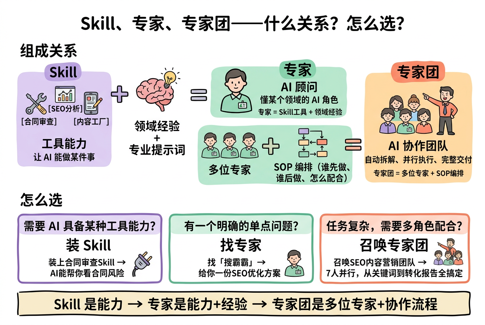
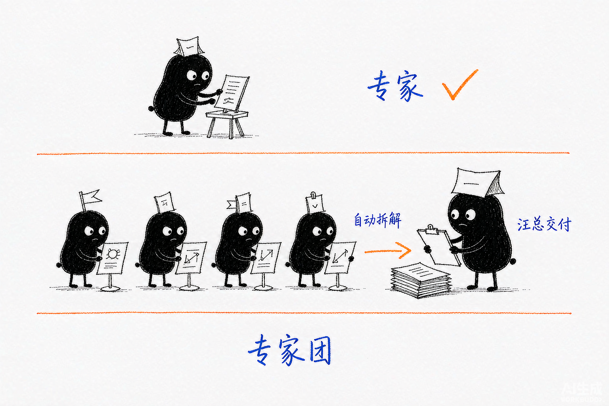
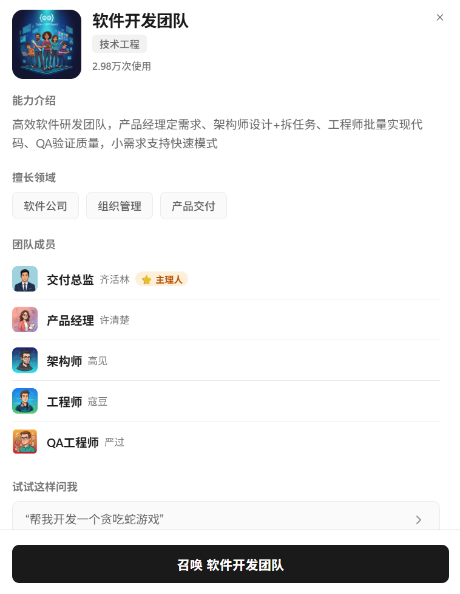
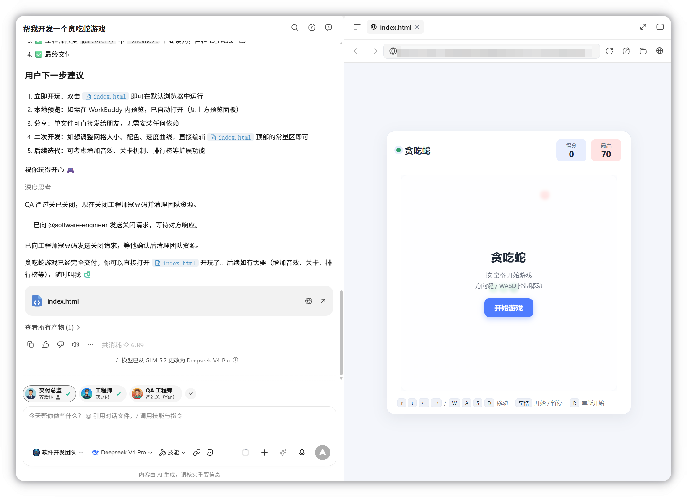
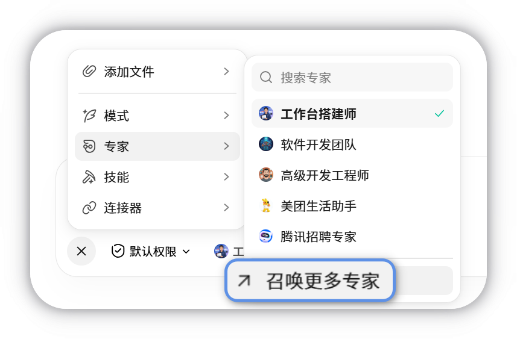

# 第 6 章 专家和专家团

> 内容来源：WorkBuddy 官方指南 · 专家（非官方整理，© 本指南作者，保留所有权利）

第 5 章你装好了 Skill —— 那解决了"AI 能做什么"。这一章解决另一个问题：
"**让谁来做**"。同一件事，让"有 10 年经验的文案"和"刚入职的新人"来做，
结果质量差很远。专家和专家团就是给 AI **换个身份**的机制。

## 一、先搞清楚：专家、专家团和 Skill 到底什么关系

这是本章最该先弄明白的问题。很多人把三者搞混，结果该用专家的时候
去装技能，该用技能的时候去召唤专家团。

官方给的这张图建议先看：

*此图片来自官方。*

官方给的一句话总结最精辟：

> **Skill 是能力 → 专家是能力+经验 → 专家团是多位专家+协作流程**

### 怎么选（官方表格）

| 维度 | Skill | 专家（Agent 型） | 专家团（Team 型） |
|---|---|---|---|
| **组成关系** | 工具能力：让 AI 能做某件事 | AI 顾问：懂某个领域的 AI 角色 | AI 协作团队：自动拆解、并行执行、完整交付 |
| **怎么选** | 需要 AI 具备某种工具能力 | 有一个明确的单点问题 | 任务复杂，需要多角色配合 |

三个白话场景：

| 你要做的 | 选哪个 |
|---|---|
| 让 AI 能看合同审查（附带风险） | **装 Skill** |
| 给我一份 SEO 优化方案 | **召唤专家** |
| 7 人并行做一轮内容营销，从关键词到转化报告全搞定 | **召唤专家团** |

*配图为示意插画，用于帮助理解专家与专家团的差别，与实际软件界面无关。*

## 二、专家是「角色切换」，专家团是「协作执行」

### 专家 = 角色切换机制

以「**人设 + 方法论 + 工具链**」让 WorkBuddy 用特定领域专家身份执行任务。
比如你召唤一个"文档评审官"，它就会用评审官的视角去看你的文档。

### 专家团 = 协作执行机制

由**多位专家分工协作**，由团长自动拆解、并行执行并整合交付。
你只需要描述目标，它自己拆任务、分配给不同专家、最后汇总。

### 一个重要的安全边界

官方明确写了：

> 专家本身**不主动获取系统权限**，仅处理你主动提供的对话与上传文件。
> **当配备了 Skill / MCP 时**才会在你的授权下间接访问文件或外部服务。

也就是说，**召唤专家不会自动获得你的文件访问权**。它能碰到什么，
取决于你有没有给它配 Skill 或连接器。

## 三、使用专家：4 步

### 第 1 步：进入专家中心

打开左侧导航栏的**「专家·技能·连接器」**，默认进入**专家**页签。

### 第 2 步：选专家或专家团

浏览卡片，查看能力介绍和任务示例。

- **专家**卡片展示：能力介绍、擅长领域、任务示例
- **专家团**卡片展示：能力介绍、擅长领域、**团队成员**、任务示例

*此图片来自官方。*

### 第 3 步：召唤

点「召唤专家」或「召唤专家团」，进入对话界面。

### 第 4 步：描述任务

**专家**：把任务告诉它，它会按照该角色的专业视角和方法完成。

**专家团**：用自然语言描述目标，专家团团长自动拆解、分配、执行并返回完整结果。

*此图片来自官方。*

## 四、快速找到专家：搜索与置顶

在对话中点击专家入口，会展开**最近使用**的专家下拉列表，提供两种快捷方式：

| 方式 | 作用 |
|---|---|
| **搜索** | 输入名称关键字快速查找专家，点击即可召唤 |
| **置顶** | 把常用专家置顶，**结果会持久保存**，下次打开排在列表前部 |

*此图片来自官方。*

**新手建议**：把 2-3 个常用的置顶，省得每次翻列表。

### 一个坑：专家团会话中不能直接换专家

在**专家团**会话里搜索召唤其他专家时，会提示：
「当前会话已使用专家团，切换其他专家需要开启新对话」。

确认后会先回到新对话态再完成召唤，**新专家不会回绑到当前专家团会话**。
所以如果你想换专家，得开新对话，别指望在专家团会话里直接切。

## 五、专家依赖的服务没连接怎么办

部分专家执行任务时会依赖 MCP 或连接器（比如腾讯文档、TAPD）。
当任务执行过程中需要某个**尚未连接**的服务时，WorkBuddy 会在**输入框上方**
展示连接引导卡片，显示服务名称和头像。

- 点卡片上的**连接**，按提示完成授权后，WorkBuddy 会**自动继续当前任务**，
  **无需重新发起对话**
- 连接引导**只在任务实际用到该服务时才出现**，不会在会话开始时一次性罗列全部依赖

这个设计挺贴心：不会一上来就给你列一堆要授权的东西，用到了才问。

## 六、创建你自己的专家

**什么情况下值得创建**：你有明确任务和工作方法，希望**重复使用**专业能力。
**如果只是临时完成一次简单任务，直接用普通对话即可**，不用专门创建。

### 创建步骤

1. 在**专家·技能·连接器 → 专家**页，点右上角**「我的专家」**
2. 点**「创建专家」**，系统自动进入创建对话，由内置的专家管理工具引导你完成配置
   ——**无需额外安装或操作**
3. 按对话指令配置专家

### 配置建议（官方给的要点）

| 配置项 | 填什么 | 反面例子 |
|---|---|---|
| **名称** | 短角色名，便于识别和召唤 | "专家1"、"助手"（无指向的名称） |
| **人设身份** | **是谁 + 有什么背景** | "帮我写代码"（写成了任务本身） |
| **擅长领域** | 写清边界，同时说明"做什么"和**"不做什么"** | "什么都行" |
| **提示词** | 工作流程、输出格式与约束，能举例最好 | 只写"您是一个专家" |

### 两个必知的限制

- **创建后无法修改名称** —— 想换名字只能重新创建。所以起名要慎重。
- **这是创建给自己（或团队成员）用的** —— 要上架到专家市场供所有人召唤，
  得按规范打包专家包并提交，那是另一套流程。

### 管理专家

在**我的专家**列表里，点卡片右上角召唤旁的**三个点**：

| 操作 | 用途 |
|---|---|
| **修改专家** | 输出不符合预期时，从角色定位、任务范围、工作方法、输入要求等方面优化 |
| **分享** | 生成链接给团队成员。**只是分享链接，不上架市场**；成员召唤的是**副本**，不影响你的配置 |
| **删除** | **无法恢复，请谨慎**。若已分享给成员，删除后对方将无法继续使用 |

## 七、一个坑：专家团的积分消耗高得多

官方提示：**专家团会并行调用多位专家、涉及多轮模型交互，积分消耗通常为
单专家的 3–5 倍**（以实际任务为准）。

**应对**：召唤专家团前先看积分余额，**别让任务执行到一半因为积分不足中断**。

## 八、本章动手：召唤一次，再对比一次

1. 打开**专家·技能·连接器 → 专家**，随便点一个专家，召唤它
2. 用一个你真实的问题问它，看它的视角和普通对话有什么不同
3. 把常用专家**置顶**一个
4. 如果有空，召唤一次**专家团**，感受它自动拆解的过程
   （**先看积分余额**）

## 九、本章任务清单（做完就算过关）

- [ ] 能说出 Skill、专家、专家团三者的区别（能力 / 能力+经验 / 多专家+流程）
- [ ] 知道专家不会主动拿你的文件权限（除非配了 Skill 或连接器）
- [ ] 召唤过一次专家，并说出它和普通对话的差别
- [ ] 把至少一个常用专家置顶
- [ ] 知道专家团会话里不能直接换专家，得开新对话
- [ ] 召唤专家团前会先看积分余额（3-5 倍消耗）
- [ ] 知道专家创建后名字改不了，起名要慎重

---

## 小白说明书

> 这一章概念多，这里统一解释。

**专家（Agent 型）**
给 AI **换一个人设和专业身份**。召唤一个"文档评审官"，它就用评审官的
视角和方法看你的稿子。它换的是"**是谁在思考**"，不是"能做什么"。

**专家团（Team 型）**
**多个专家协作**。你给一个复杂目标，团长自动拆解任务、分配给不同成员、
并行执行、最后汇总交付。换的是"**几个专业的人一起干**"。

**人设 + 方法论 + 工具链**
专家的三个组成：
- **人设**：我是谁（10 年经验的工程师）
- **方法论**：我怎么做事（先看架构再看代码）
- **工具链**：我能调用什么（配了哪些 Skill）

专家**本身不自带权限**。只有配上工具链（Skill/连接器），它才能碰到外部东西。

**SOP 编排**
专家团的工作流程：谁先做、谁后做、怎么配合。官方定义是
"**专家团 = 多位专家 + SOP 编排**"。

**并行执行**
多个任务**同时**跑，不是排队等。所以快，但也更耗积分。

**我的专家**
你创建的专家列表。在专家页右上角点进去。

**创建专家**
用**对话引导**的方式配置——系统会一步步问你，你可以直接采用它给的示例，
也可以按自己的任务改。**不需要写代码，也不需要额外安装。**

**专家名不可改**
创建后名字**改不了**，想换只能重建。所以别叫"专家1"。

**修改 vs 删除**
- **修改**：优化配置（角色、范围、方法、输入要求），可反复改
- **删除**：**永久消失，不可恢复**。已分享给别人的，对方也用不了了

**分享专家 vs 上架市场**
- **分享**：生成一个链接发给同事，他们召唤的是**副本**，你的配置不受影响
- **上架**：放到专家市场让所有人能搜到，要按官方规范打包提交

**置顶**
把常用专家固定在列表前面，**结果会持久保存**，下次打开还在。
相当于给常用联系人设星标。

**MCP**
一个让外部工具接入的标准协议。你可以在别处看到这个词，作用是
"让 AI 能连到某个服务"。第 7 章讲连接器时会再遇到。

**积分消耗倍数**
专家团要调多个专家、多轮交互，消耗是单专家的 3-5 倍。
**召唤前先看余额**，否则做到一半可能因积分不足中断。

---

*下一篇：第 7 章 使用连接器——把外部邮箱、文档、IM 接进来。*
