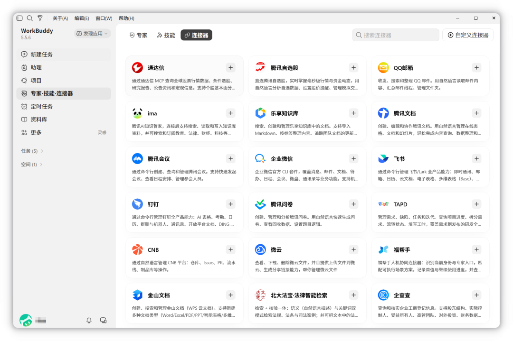
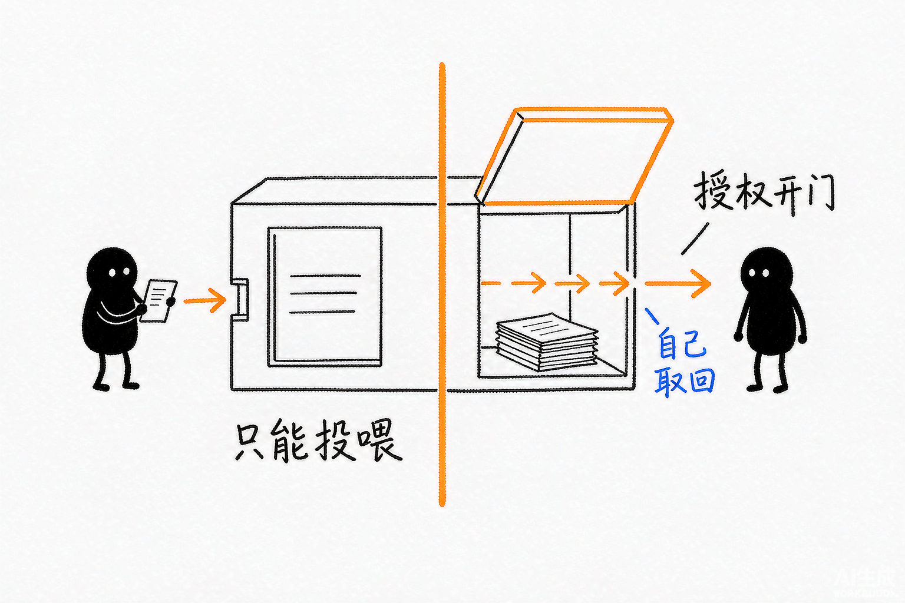
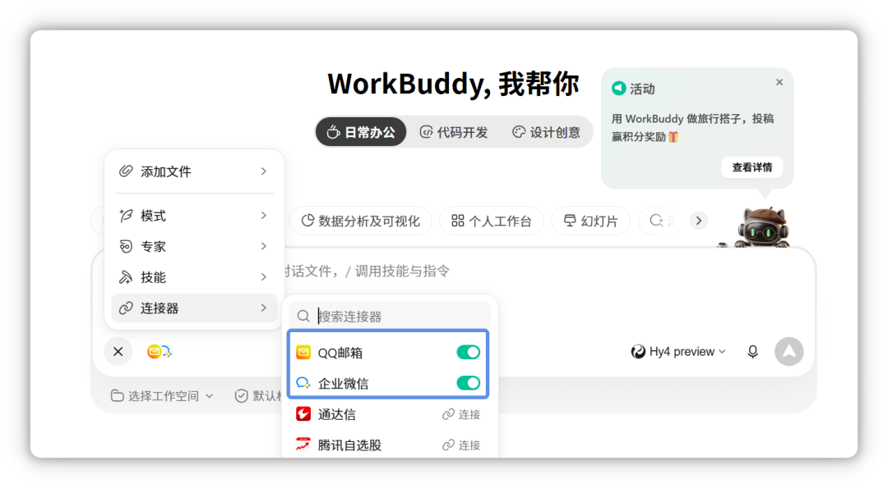
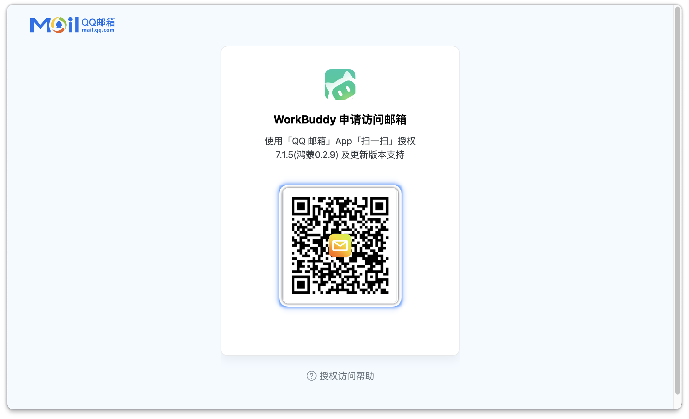
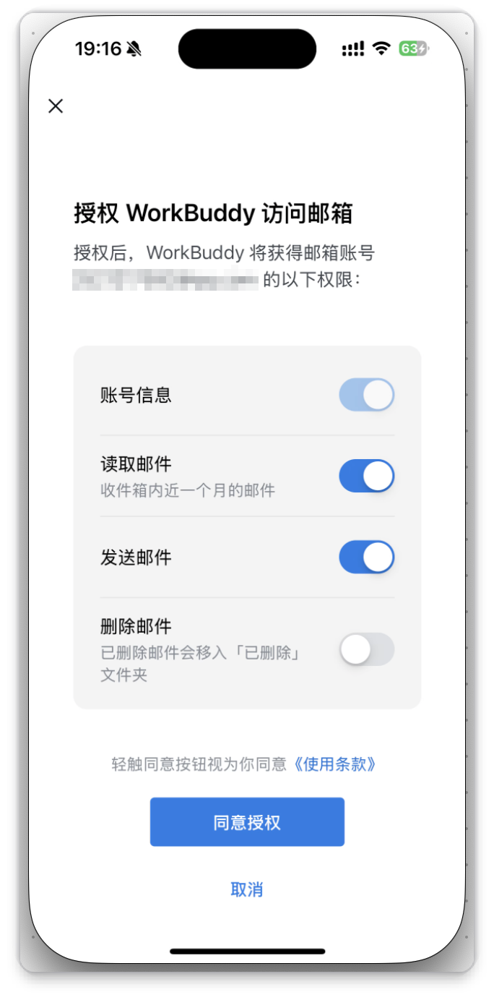
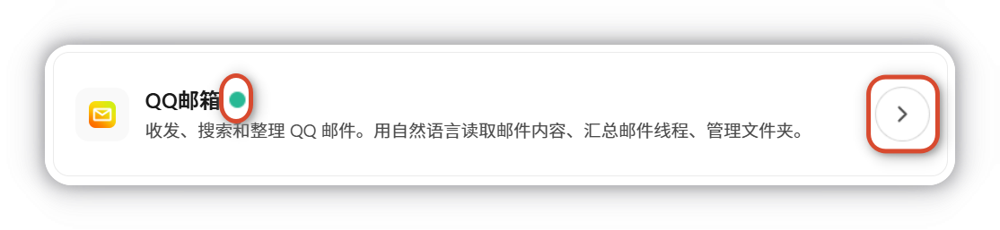

# 第 7 章 使用连接器

> 内容来源：WorkBuddy 官方指南 · 连接器（非官方整理，© 本指南作者，保留所有权利）

前两章你有了工具（Skill）和专业身份（专家）。但还有一个问题没解决：
**AI 怎么碰到你公司邮箱里的那封邮件？** 连接器就是干这个的——
把外部服务接进来，让 AI 能在你授权的范围内读取和操作外部数据。

## 一、连接器是什么

连接器用于**将 WorkBuddy 与外部服务对接**，把外部数据和能力引入 AI 工作流。
配置好之后，WorkBuddy 在获得授权后就能访问和操作第三方服务。

从实现形态看分两种：**MCP + CLI**（标准化协议）和 **Skill + CLI**（内置脚本），
两者在数据收集和权限边界上遵循一致原则。

**当前已支持**：QQ 邮箱、腾讯文档、腾讯乐享、腾讯会议、TAPD、腾讯网盘等，
同时支持自定义连接器。

*此图片来自官方。*

## 二、连接器能做什么

| 场景 | 说明 | 示例 |
|---|---|---|
| **数据查询** | 从外部数据源获取信息 | 查询数据库、检索文档 |
| **服务调用** | 调用第三方 API 完成操作 | 发送邮件、创建日程 |
| **文件管理** | 访问云端存储与文件系统 | 读取网盘文件、上传附件 |
| **消息通知** | 与即时通讯工具集成 | 发送企业微信/飞书消息 |

**一句话理解**：连接器是**AI 通向外面的门**。没连接器，AI 只能处理你喂给它的东西；
连上之后，它能自己去取。

*配图为示意插画，用于帮助理解连接器的作用，与实际软件界面无关。*

## 三、添加连接器：4 步

1. 在左侧边栏点击**「专家·技能·连接器」**，选中**连接器**页签
2. 找到需要使用的连接器，点击卡片右上方的 **`+`**
3. 按页面提示完成**登录、授权**或其他配置
4. 完成授权后，即可在 WorkBuddy 中使用该连接器

## 四、使用连接器：三种方式

连接器支持多种用法，你可以提前授权，也可以在任务中按需添加。

### 方式一：从连接器页面直接发起对话

在**连接器管理**页面中，找到已授权的连接器，点击卡片右上角的**「去对话」**，
直接开始使用。**适合你已经知道要用哪个连接器的时候。**

### 方式二：创建任务时启用

新建任务时，点击输入框左下角的 **`+` > 连接器**，在弹窗中开启需要的连接器。

*此图片来自官方。*

**尚未完成授权的连接器，需要先完成授权后才能使用。**

### 方式三：执行任务时按需连接（最省心）

任务执行过程中，如果需要用到尚未连接的连接器，**输入框上方会自动显示
连接引导卡片**。点卡片并按提示完成授权后，WorkBuddy 将**自动继续执行当前任务**，
**无需重新发起对话**。

**这个设计对你很友好**：不用提前把所有连接器都授权一遍，用到哪个说哪个。

## 五、停止使用与解绑

这两件事要分清：

| 操作 | 怎么做 | 效果 |
|---|---|---|
| **停止使用** | 输入框左下角 **`+` > 连接器**，取消对应连接器的启用状态 | 暂时不用，但**授权还在** |
| **解绑** | 连接器管理页面 → 选中已连接的连接器 → 弹窗中点**「解绑」** | **断开授权**，恢复为未连接状态 |

**什么时候该解绑**：不再用的连接器**建议及时撤销授权**——
授权 Token 相当于你账号的钥匙，闲着不用就收起来。

## 六、实战：连接 QQ 邮箱（最常用的一个）

QQ 邮箱连接器支持**收发、搜索和整理** QQ 邮件：用自然语言读取邮件内容、
汇总邮件线程、管理文件夹。

### 第 1 步：发起连接

在连接器管理页面找到**QQ 邮箱**卡片，点击右侧的 **`+`** 按钮。

### 第 2 步：扫码授权

系统跳转到 QQ 邮箱授权页面，显示二维码。
用 **QQ 邮箱 App**（7.1.5 / 鸿蒙 0.2.9 及更新版本）扫码授权。

*此图片来自官方。*

### 第 3 步：确认权限（这一步最重要）

在手机端确认 WorkBuddy 申请的访问权限：

*此图片来自官方。*

| 权限 | 内容 | 建议 |
|---|---|---|
| **账号信息** | 获取邮箱账号基础信息 | 必需 |
| **读取邮件** | 读取收件箱内**近一个月**的邮件 | 必需 |
| **发送邮件** | 代为发送邮件 | 常用就开 |
| **删除邮件**（可选） | 已删除邮件会移入「已删除」文件夹 | **默认关闭，建议别开** |

确认无误后点**「同意授权」**。

**为什么建议关掉"删除邮件"？** 删邮件是不可逆操作，AI 误删你一封重要邮件
你找不回来。**读和发都够用了，删除这个权限没必要给。**

### 第 4 步：完成连接

授权成功时点击浏览器弹窗中的**「打开」**完成连接。

> **提示**：取消或者直接关闭网页**可能会导致操作中断**，需要重新配置连接器。

授权成功后，可在「设置 - 账号 - 安全管理 - 登录设备和授权码 - 应用授权」
中管理授权应用。

### 第 5 步：确认连接成功

回到 WorkBuddy，QQ 邮箱卡片名称旁会出现**绿色圆点**，并提示
**「连接器 QQ 邮箱 已连接」**，右侧显示「去对话」按钮。

*此图片来自官方。*

**看到绿点就成了。**

## 七、实战：连接腾讯乐享

腾讯乐享连接器支持**搜索、创建和管理**乐享知识库中的文档，
支持导入 Markdown、按标签整理内容、追踪团队文档的更新动态。

流程和 QQ 邮箱类似：

1. 在连接器管理页面找到**腾讯乐享**卡片，点击 **`+`**
2. 进入授权确认页面，通过乐享知识库 MCP，WorkBuddy 将能够：
   - 按你拥有的权限访问知识库
   - 搜索、查询知识库中的内容
   - 协助创建与管理知识库中的内容

   确认无误后点**「立即前往授权」**
3. 登录乐享知识库，支持**微信登录**、**手机号登录**两种方式
4. 页面显示账号信息及 WorkBuddy 将要获取的权限，确认后点**「继续」**
5. 回到 WorkBuddy，卡片旁出现**绿色圆点**，右侧显示「去对话」按钮

## 八、自定义连接器

如需接入其他外部服务，点连接器管理页面右上角的**「自定义连接器」**按钮，
安装自定义的 MCP 服务。

> **提示**：自定义连接器的配置方式与 MCP 配置类似。

**注意**：自定义连接器的访问范围**由你的配置决定**，官方不预设范围，
**请审慎评估后再启用**。

## 九、安全边界：官方明确的四条

### 权限边界三条

- **每个连接器独立授权** —— 连了 QQ 邮箱不代表连了腾讯文档
- **不主动定时抓取** —— 它只在你下指令时才去取数据
- **不超出你已有权限范围** —— 你在 QQ 邮箱里本来就读不到的，它也读不到

### 会收集哪些信息

| 收集项 | 类型 | 用途 |
|---|---|---|
| 第三方账号标识 | 必要 | 邮箱地址、账号 ID 等，用于识别身份 |
| 授权凭据 | 必要 | OAuth Access/Refresh Token，或你手动填写的 API 密钥 |
| 第三方业务数据 | 必要 | **仅在你的指令触发时**按需读取（邮件、文档、知识库、会议、TAPD 项目数据等） |
| 用户写入数据 | 非必要 | 代发邮件、创建/编辑文档、创建会议等，**需你明确指令确认** |

### 两个提醒

- **积分消耗**：连接器自身的读写**不消耗积分**；但 WorkBuddy 对**外部数据**
  进行理解、汇总时**会消耗积分**。
- **第三方共享**：**用连接器就等于跟第三方服务交互**，凭据由 WorkBuddy 维护
  以便代你调用。

### 使用建议（官方原文要点）

- 连接器调用产生的访问、读写、消息发送，**均以你本人身份执行**，
  **建议在涉及对外发送、内容修改前再次确认目标对象与内容**
- API 密钥与 Token 是访问你第三方账号的钥匙，**请妥善保管，避免在公共设备
  或共享环境填写**
- 不再使用的连接器**建议及时撤销授权**

## 十、本章动手：连一个你真的会用到的

1. 进**「专家·技能·连接器」→ 连接器**
2. 找**QQ 邮箱**，点 `+`，按提示扫码
3. 在手机端确认权限，**把"删除邮件"保持关闭**
4. 授权完成后点浏览器弹窗的**「打开」**
5. 回到页面确认出现**绿点 + 「去对话」**
6. 点**「去对话」**，试一次："帮我看看最近一周有哪些重要邮件没回"

## 十一、本章任务清单（做完就算过关）

- [ ] 说出连接器的作用（把外部服务接进来，AI 能自己取数据）
- [ ] 知道已支持哪些（QQ邮箱、腾讯文档、乐享、会议、TAPD、网盘…）
- [ ] 说出连接器能做的 4 类事（查询、调用、文件、消息）
- [ ] 独立完成一次 QQ 邮箱授权，页面出现绿点和「去对话」
- [ ] 知道"停止使用"和"解绑"的区别
- [ ] 授权时看清楚每项权限，**没必要的权限不开**（尤其删除类）
- [ ] 知道"取消授权网页会中断连接"这个坑
- [ ] 知道 Token 不能在公共设备上填
- [ ] 不用了的连接器会及时撤销授权

---

## 小白说明书

> 这一章是术语最密集的一章，慢慢看。

**连接器（Connector）**
把外部服务接到 WorkBuddy 上的一道**门**。接上之后 AI 能自己进去取东西，
不用你手动复制粘贴。类比：Skill 是给 AI 加工具，连接器是给 AI 开门。

**外部服务**
指 WorkBuddy 之外的东西：你的 QQ 邮箱、腾讯文档、企业微信、TAPD 项目……
这些数据本来在别人的服务器上，AI 碰不到。

**授权 / 扫码授权**
让第三方服务同意"WorkBuddy 可以代表我访问我的数据"。
你扫一次码、在手机上点"同意"，就等于把自己的钥匙交给了它。
**授权是可撤销的。**

**OAuth Token**
授权成功后拿到的一串"钥匙"。有了它 AI 才能代表你访问，
**不用每次输密码**。这串东西很敏感，泄露了等于别人能登你账号。

**API 密钥**
有些服务用一串字符当钥匙代替扫码。作用和 Token 一样，
**同样要当密码保管。**

**数据查询 / 服务调用 / 文件管理 / 消息通知**
连接器能干的四类活：
- **查询**：去数据库或文档里找信息
- **调用**：调第三方接口做事（发邮件、建日程）
- **文件**：读网盘、传附件
- **消息**：往企微/飞书发通知

**绿色圆点**
连接成功的标志。看到它就说明授权已完成、连接器可以用了。
**如果授权了还是没绿点**，多半是网页被关掉了，需要重新配。

**「去对话」**
直接用这个连接器开一个对话。适合你已经明确要用哪个服务的时候。

**按需连接 / 连接引导卡片**
任务执行中才弹出授权提示。用到哪个才问哪个，
不用提前把一堆连接器全授权。授权后**任务会自动继续**，不用重新发起。

**解绑**
断开连接、撤销授权。解绑后连接器恢复未连接状态。
**不用了记得解绑**，别让钥匙一直挂在那。

**停止使用**
临时关闭，**授权还保留着**。和解绑的区别就在这。

**自定义连接器**
官方没提供的服务，你可以自己装一个 MCP 服务来接。
**访问范围完全由你的配置决定**，官方不预设，所以要自己评估风险。

**MCP**
一个让外部工具接入 AI 的标准协议。官方连接器里两种实现方式之一就是
"MCP + CLI"。你只要知道"它是接外部工具的协议"就行。

**权限边界三条**
- **独立授权**：连一个不等于连全部
- **不主动抓取**：不下指令就不去取
- **不超出已有权限**：你读不到的，它也读不到

这三条是官方给的边界承诺，说明它不会偷偷多拿你的数据。

**删除邮件这个权限**
危险权限之一。AI 删邮件**不可逆**。默认是关闭的，
**建议就让它关着**——读和发够用了。

**Token / 密钥泄露的后果**
拿到 Token 的人**可以以你的身份**访问邮箱、文档等。
所以**别在网吧、别人电脑上填**。用完的连接器及时撤销。

---

*下一篇：第 8 章 接入小程序与 IM 助理——让 AI 在手机上也能干活。*
