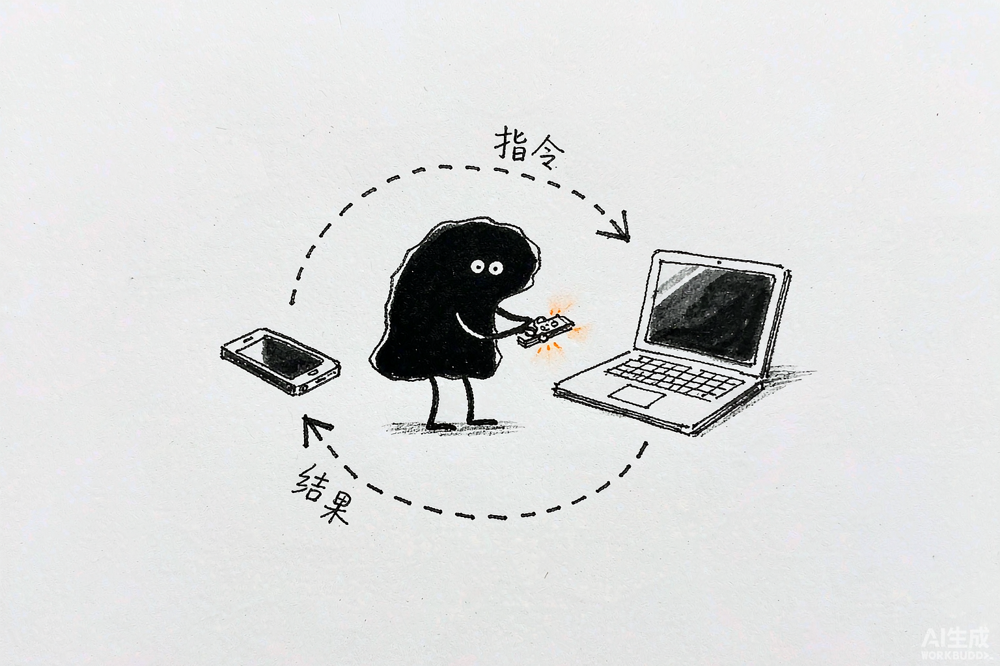
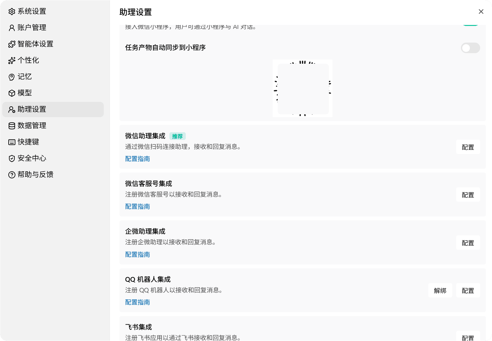
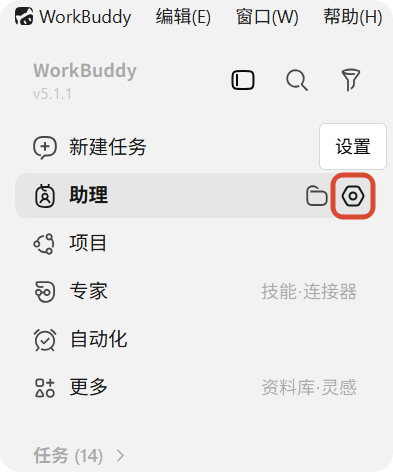
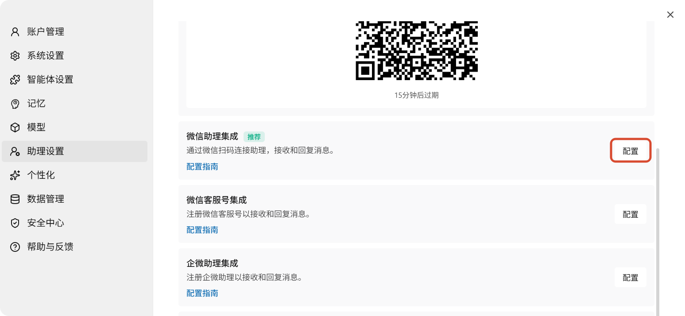
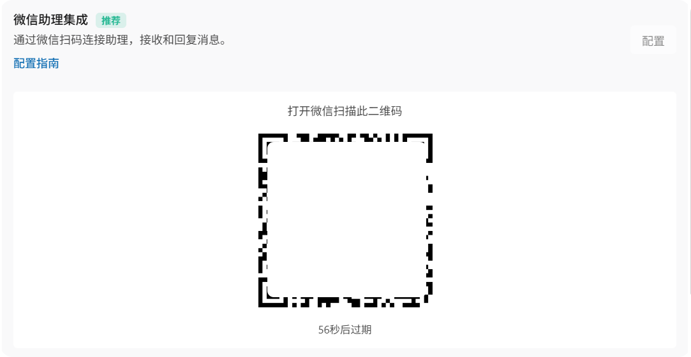
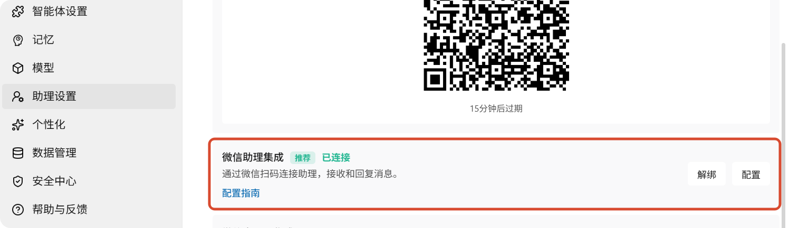
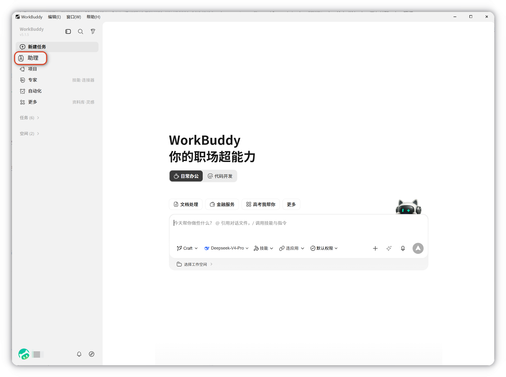
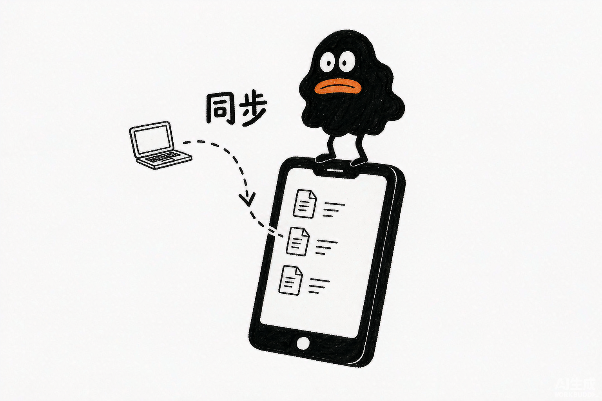

# 第 8 章 接入小程序与 IM 助理

> 内容来源：WorkBuddy 官方指南 · 助理（远程任务）（非官方整理，© 本指南作者，保留所有权利）

前七章，你的每一步操作都发生在电脑前。这一章解决一个现实问题：**人不在电脑前，活儿怎么办？**

WorkBuddy 给了两个答案：

1. **IM 助理**——在手机上的微信、QQ、飞书里发条消息，远程遥控电脑上的 WorkBuddy 干活；
2. **小程序**——电脑上生成的文档、表格、PPT 自动同步到手机上的 WorkBuddy 小程序，随时看、随时转。

一个管"派活"，一个管"收货"。配齐这两样，你的 AI 工作台就真正随身携带了。

## 一、IM 助理：给 WorkBuddy 配一个"遥控器"

官方文档的比喻很直白：助理就像一个**遥控器**——在手机上发一条消息，电脑上的 WorkBuddy 就会自动执行任务，执行完成后，结果会回复到你的手机上。

*配图为示意插画，用于帮助理解远程控制的过程，与实际软件界面无关。*

支持的平台不少，先看清楚再选：

| 平台 | 特点 | 适合谁 |
|---|---|---|
| **微信助理**（推荐） | 扫码即连，配置最简单 | 大多数个人用户 |
| 微信客服号 | 注册微信客服号收发消息 | 有客服/公众号场景 |
| 企微助理 | 在企业微信群 @机器人 下任务 | 团队协作 |
| QQ 机器人 | 注册 QQ 机器人接入 | QQ 重度用户 |
| 飞书 | 注册飞书应用接入 | 飞书办公团队 |
| 钉钉机器人 | 注册钉钉机器人接入 | 钉钉办公团队 |

第一次接入，无脑选**微信助理**，本章第三节就用它做示范。

**远程任务和普通任务的区别**，官方给了一组对比，值得看一眼：

| 对比项 | 普通任务 | 助理 |
|---|---|---|
| 工作目录 | 自由指定 | 固定使用**助理**专属文件夹 |
| 新建对话 | 支持多个并行任务 | 仅一个会话，所有远程指令集中处理 |
| 上下文管理 | 可清空历史重新开始 | 保留完整对话历史，不可清空 |

官方建议原话：**本地操作优先使用主界面的普通任务；需要远程触发或统一查看记录时，再使用助理。**

## 二、找到助理入口

在主界面左侧导航栏，「新建任务」下面就是**「助理」**。

*此图片来自官方。*

点进去就是助理页面。之后所有远程任务的完整执行记录——思考过程、操作步骤、生成文件和最终结果——都在这里看。

## 三、第一次接入：微信助理扫码绑定

整个流程 4 步，跟着截图点就行。

**第 1 步**：点侧边栏「助理」右侧的**齿轮图标**，打开助理设置。

*此图片来自官方。*

**第 2 步**：在助理设置页找到「微信助理集成」（带推荐标），点右侧**「配置」**按钮，页面会生成一个二维码。

*此图片来自官方。*

**第 3 步**：**打开手机微信扫一扫**，扫这个二维码。

*此图片来自官方。*

**第 4 步**：扫码成功后，卡片上会亮起**「已连接」**，同时多出一个「解绑」按钮——说明绑定完成。

*此图片来自官方。*

**新手必踩的坑：二维码过期。** 二维码是临时生成的，页面上标着倒计时（设置页 15 分钟，扫码页甚至只有 56 秒）。过期了不要慌，回到助理设置重新点一次「配置」，生成新码再扫即可。

另外两个前置条件别忽略：**电脑必须开机并运行着 WorkBuddy**，网络要正常。电脑关机了，手机端发什么都不会有回应。

## 四、任务产物自动同步到小程序

派活解决了，再解决收货。

还是在**助理设置**页的最顶部，有一个开关：**「任务产物自动同步到小程序」**。把它打开。

*此图片来自官方。*

开启后，WorkBuddy 每次在电脑端完成任务，生成的报告、文案、表格、PPT 都会自动推送到你的 WorkBuddy 小程序：

1. 打开微信，**下拉聊天列表**进入小程序面板，点开 workbuddy 小程序；
2. 产物按时间排列，可以浏览文档、复制文案、查看图表；
3. 支持一键转发给微信好友或群聊，也能保存到手机本地；
4. 仅同一账号可见——系统会校验手机和电脑是同一个 WorkBuddy 账号，不用担心隐私串门。

*配图为示意插画，用于帮助理解小程序同步的过程，与实际软件界面无关。*

这个能力在第 10 章的自动化任务里还会再次出现：创建定时任务时可以勾选「推送到小程序」，任务结果自动送进手机。

## 五、解绑与安全边界

不想用了，或者要换号：

1. 打开 **设置 → 助理设置**；
2. 在列表里找到目标平台，点卡片右侧的**「解绑」**。

解绑后：该平台账号不再能向这台 WorkBuddy 发指令，接入配置从本地删除；但已执行任务的历史记录保留在本地，其他已绑定平台不受影响。平台侧的机器人还在，只是消息没人接了。

**安全边界**（官方明确写的三条）：

- **绑定身份**：助理设置中配置关联账号，支持灵活换绑；
- **来源校验**：每一条远程指令都经过多层来源校验，不是谁都能指挥你的电脑；
- **高风险确认**：涉及文件删除、系统配置修改、批准命令执行等操作，需确认后才会执行。

所以"手机遥控电脑"并不等于"裸奔"，这三层保险默认就在工作。

## 本章任务清单

- [ ] 打开 设置 → 助理设置，认出六张平台集成卡片
- [ ] 完成微信助理扫码绑定，看到「已连接」
- [ ] 在手机上给 WorkBuddy 发一条远程任务，等结果回微信
- [ ] 打开「任务产物自动同步到小程序」，在手机小程序里找到电脑端刚生成的产物
- [ ] （可选）走一遍「解绑」流程，确认自己会随时取消绑定

## 小白说明书

> **IM**：Instant Messaging（即时通讯）的缩写，就是微信、QQ、飞书这类聊天软件。
>
> **助理**：WorkBuddy 的远程控制功能。你手机发消息，电脑执行，结果回手机。
>
> **绑定**：把你的聊天账号和电脑上的 WorkBuddy 关联起来。之后这个账号发的消息会被当成指令。
>
> **二维码**：一张方形图案，用手机扫一下就能完成配对，不用手动输账号密码。
>
> **小程序**：微信里不用下载 App 就能用的轻量应用。这里指 WorkBuddy 官方小程序，用来在手机上看产物。
>
> **上下文**：AI 记住的之前对话内容。助理会完整保留对话历史，不可清空，越用越"懂你"。
>
> **解绑**：解除绑定。之后该账号发的消息不再被 WorkBuddy 接收。

---

*下一篇：第 9 章 如何接入外部 API——给 WorkBuddy 接上你自己的"外脑"。*

*本指南为第三方非官方整理，版权归作者所有，转载请注明出处。*
