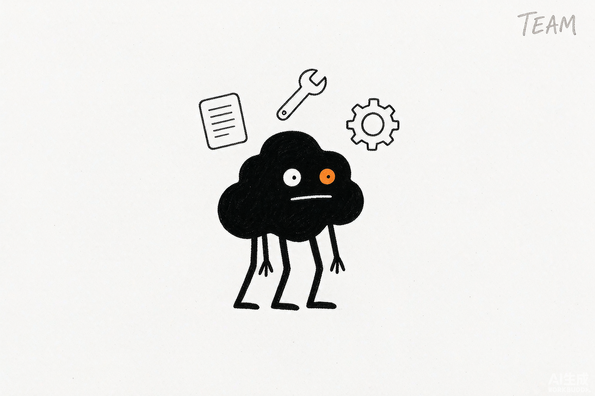

# 本篇导读 · 第二篇 案例篇：从一项任务到一支 AI 团队

> 内容来源：WorkBuddy 官方指南与社区实战案例整理（非官方，© 本指南作者，保留所有权利）

第一篇你学会了"每一个零件怎么用"——建任务、装技能、请专家、接账号、定自动化。
这一篇换一种学法：**直接用真实场景把你拖下水**。我们不教你新按钮，而是带你跑通
一件件具体的事：写一份 Word、理一遍乱桌面、不在电脑前也能让它干活、把每天的新闻
汇成一条推送、把会议录音变成行动清单……

做完这 11 个案例，你会发现 WorkBuddy 已经不是"一个工具"，而像**一支随叫随到的
AI 小队**——你发一句话，它就分头去办。

*配图为示意插画，用于帮助理解"从一项任务到一支 AI 团队"，与实际软件界面无关。*

## 贯穿全篇的一个理念：零成本 Skill

这一篇反复会提到"零成本 Skill"，先讲清楚它是什么，后面你就不陌生了。

所谓"零成本"，不是免费蹭，而是**不花一分钱、不用写一行代码，把你的经验变成可复用的工具**：

1. **先用现成的免费技能把任务跑通。** SkillHub 上有很多免费技能，装好即调用，
   不用额外配置。新手最该先装的有几个"黄金组合"：`pdf`（读长文/提取/合并/水印）、
   `xlsx`（读写 Excel/清洗/图表）、`pptx`（生成 PPT）、`docx`（写 Word）、
   `browser-automation`（替你点网页/抓数据）、`腾讯文档`（在线协作）、
   `find-skills`（**技能雷达**，告诉它你的工作流，它帮你挑该装哪些）。
2. **跑顺之后，用 `skill-creator` 把你的 SOP 固化成"只属于你"的技能。**
   你用自然语言描述需求，它自动生成技能文件。比如你每周都做"团建策划"，
   就把它做成技能，下次只说主题就能出初稿——这是"零成本"的精髓。
3. **`find-skills` 当参谋**：不知道有没有现成技能时，问它"我经常要处理发票，
   有什么合适的技能？"，它帮你配装。

> 装技能的三条铁律：**认准官方源**（优先 SkillHub 官方市场，腾讯做过安全过滤）；
> **警惕野路子**（陌生人私发的技能文件别直接跑，先验源、看权限、查评价）；
> **同类装一个就够**（装多了占资源还可能指令冲突）。

## 本篇每个案例的统一读法：五问定标

多数"AI 做得不好"的案例，根因不是模型不行，是人没把交付标准说清。所以每个案例
开头我都用这五个问题给任务定标，你照着填，跑出来的东西就靠谱得多：

| 问题 | 要说清什么 | 示例 |
|-|-|-|
| **目标** | 这份产出要帮谁做什么决定 | 给部门负责人看，判断项目是否继续投入 |
| **受众** | 阅读者是谁、懂不懂背景 | 管理层只看结论；项目组要过程和责任人 |
| **材料** | 哪些是事实来源、哪些只是参考 | `data.xlsx` 是唯一数据口径，旧版只参考结构 |
| **格式** | 要 Word、Excel、PPT，还是三者联动 | 一份复盘 Word + 一张风险台账 Excel |
| **验收** | 怎么判断结果可用 | 数字能回源、公式可刷新、PPT 投屏不溢出 |

每个案例的正文结构也固定为六块：**痛点 → 先选对 Skill（组合表）→ 真实可复制
提示词 → 执行步骤表 → 实际效果 → 验收标准**。你能直接照抄的提示词，都用代码块
给出，方括号 `【】` 里是占位符，换成你自己的内容即可。

## 怎么读这一篇

不用从头读到尾，**按你的痛点挑**：

- 天天和文档打交道 → 先看第 11 章（办公三件套）
- 电脑桌面一团乱 → 第 12 章（整理文件）
- 经常不在电脑前 → 第 13 章（远程控制）
- 想让信息自动找你 → 第 15 章（资讯整合）
- 收藏了一堆却用不上 → 第 16 章（知识管理）
- 会议多、纪要烦 → 第 17 章（会议）
- 想看看投资 / 视频 / 自媒体 / GEO → 第 18–21 章

## 一条安全底线（全篇通用）

动文件、资金、账号之前，**先确认再执行**；删除之前必须出清单、先备份；公共 Wi-Fi
下不发敏感指令。AI 很听指令，但"不可逆操作"这道闸得你自己守。

## 本章任务清单

- [ ] 翻完本篇目录，圈出最戳你痛点的 3 个案例
- [ ] 在 SkillHub 先装好 `find-skills`，让它给你的工作流配一套技能包
- [ ] 选 1 个案例，今天就照着跑通一次，并记一句话：哪里顺、哪里卡

---

*下一篇：第 11 章——办公三件套：Word、Excel、PPT，多数人第一次感受到 AI 价值的地方。*

---

*本指南为第三方非官方整理，版权归作者所有，转载请注明出处。*
