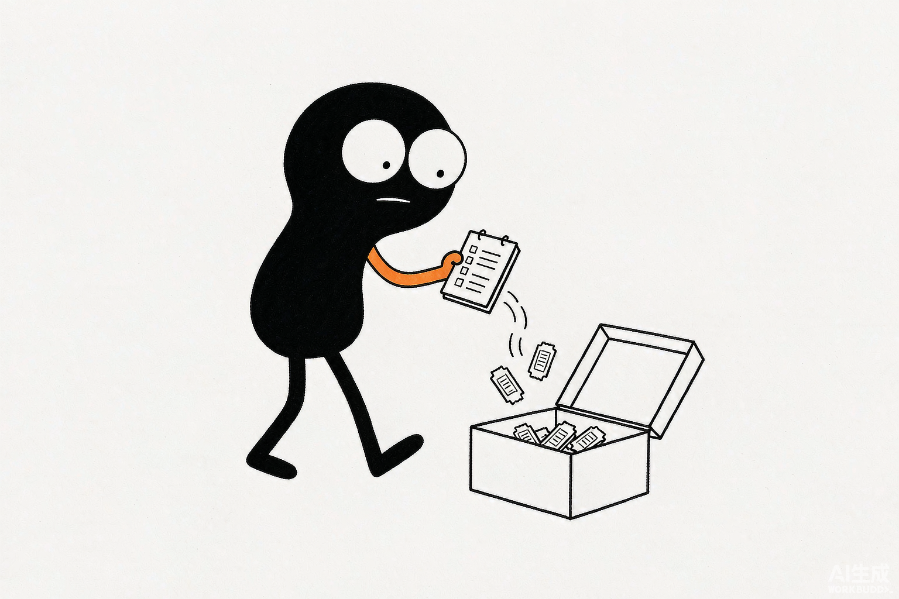

# 第 14 章 生活助手的价值，是减少琐碎

> 内容来源：WorkBuddy 官方指南（非官方整理，© 本指南作者，保留所有权利）

工作之外，生活里有一大堆"不起眼但费神"的小事：查攻略、拟一段话、算个账、
记个提醒。WorkBuddy 当生活助理，价值不在"多厉害"，而在**把琐碎接住**，
让你把注意力留给重要的事。

*配图为示意插画，用于帮助理解"生活助手"，与实际软件界面无关。*

## 一、生活里哪些琐事适合甩给它

| 琐事 | 你这么说 | 它给你 |
|---|---|---|
| 出行攻略 | "周末两天去杭州，给个轻松行程" | 一份能照走的安排 |
| 拟一段话 | "帮我写条委婉拒绝饭局的微信" | 可直接发的文字 |
| 算笔账 | "三人 AA，总计 386，各付多少" | 算好的数 |
| 做提醒 | "提醒我周五交水电费" | 一条待办（接日历后更稳） |

注意最后一条：提醒要靠"连接器"接上你的日历/待办才能真正生效，接法见
第一篇第 7 章。

## 二、一个生活助手的典型用法

把它当"随叫随答的参谋"。遇到要拿主意的小事，先问它一句，再自己拍板：

> "我想给妈妈挑个生日礼物，预算 300 内，她喜欢园艺，给几个选项和理由。"

它给选项和理由，你选——决策还是你的，但不用从零想。

## 三、和生活助手相处的分寸

它擅长"给方案"，不擅长"替你负责"。涉及人际关系、花钱、健康的事，
把它当参考，别当裁判。尤其是健康建议，以专业人士为准。

## 一个必须记住的坑

别把隐私当闲料乱喂。地址、身份证、家人信息这类敏感内容，尽量别写进任务里；
如果用了连接器接了私人账号，记得第一篇第 7 章讲的"解绑与来源校验"。

## 小白说明书

> **生活助理**：把 AI 用在个人日常琐事上，帮你规划、拟稿、计算、提醒。
>
> **参谋 vs 裁判**：AI 给选项和依据（参谋），最终决定权在你（裁判）。

## 本章任务清单

- [ ] 用"出行攻略"示例，让它规划一次你真要去的短途
- [ ] 让它拟一条你最近要发的、不好开口的消息
- [ ] 梳理一遍：哪些隐私信息以后不写进任务里

---

*下一篇：第 15 章——资讯整合，把信息流变成每日通知。*

---

*本指南为第三方非官方整理，版权归作者所有，转载请注明出处。*
