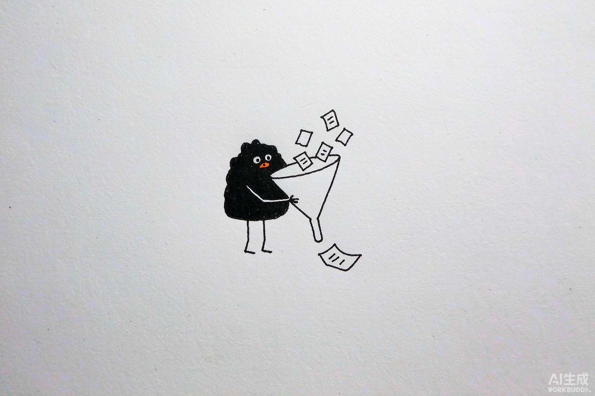

# 第 15 章 资讯整合：把信息流变成每日通知

> 内容来源：WorkBuddy 官方指南（非官方整理，© 本指南作者，保留所有权利）

你每天被热搜、公众号、群消息淹没，却总觉得"没记住什么"。这一章教你用
WorkBuddy 把信息**反向推给你**：设定好关注点，让它定时去搜集、汇总、精简，
每天早上把一条干净的简报送到你手机（见第一篇第 8、10 章的推送能力）。

*配图为示意插画，用于帮助理解"资讯整合"，与实际软件界面无关。*

## 一、它解决的是什么痛点

不是"信息太少"，而是"信息太散、太噪"。你要的是：**每天一份，只讲我关心的，
三分钟看完**。这正好是自动化的强项（机制见第一篇第 10 章）。

## 二、搭一条"每日简报"流水线

把这几样串起来：

1. **连接器**接上信息源（新闻、你关注的账号/RSS，接法见第一篇第 7 章）
2. **自动化**设一个"每天早上 8 点"的定时任务（第一篇第 10 章）
3. 任务里写清：关注哪几个主题、要什么格式、别超过多少字
4. 结果**推送到小程序/微信**（第一篇第 8、10 章）

> 示例提示词："每天早上 8 点，搜集 AI 和新能源两条线的昨天要闻，各 3 条，
> 每条一句话+来源链接，汇总成一份简报推送到我微信。"

## 三、让简报真的"为你定制"

别只说"搜新闻"，要说清**你关心什么、不关心什么**：

- 行业：只盯你所在的领域，别全量
- 语气：要"发生了什么"，不要"小编点评"
- 长度：强制上限，防止它越写越嗨

## 一个必须记住的坑

自动化是"无人值守"跑的（第一篇第 10 章讲过）。**定期回看一眼简报质量**：
信息源变了、链接失效了、它开始编内容了——这些要靠你偶尔抽查发现。
别设完就彻底撒手。

## 小白说明书

> **信息源**：你让 AI 去取信息的出处，比如某个网站、RSS、账号。接上才够得着。
>
> **简报（Digest）**：把多篇信息压缩成一份简短汇总，省你去逐条看。
>
> **RSS**：一种订阅网站更新的标准格式，很多博客/媒体都提供，适合做信息源。

## 本章任务清单

- [ ] 用示例提示词，先手动跑一次"每日简报"看效果
- [ ] 把它设成自动化，每天早上推送到手机
- [ ] 设个每周抽查：确认简报没跑偏、没编内容

---

*下一篇：第 16 章——收藏不是知识管理，能再次用起来才是。*

---

*本指南为第三方非官方整理，版权归作者所有，转载请注明出处。*
