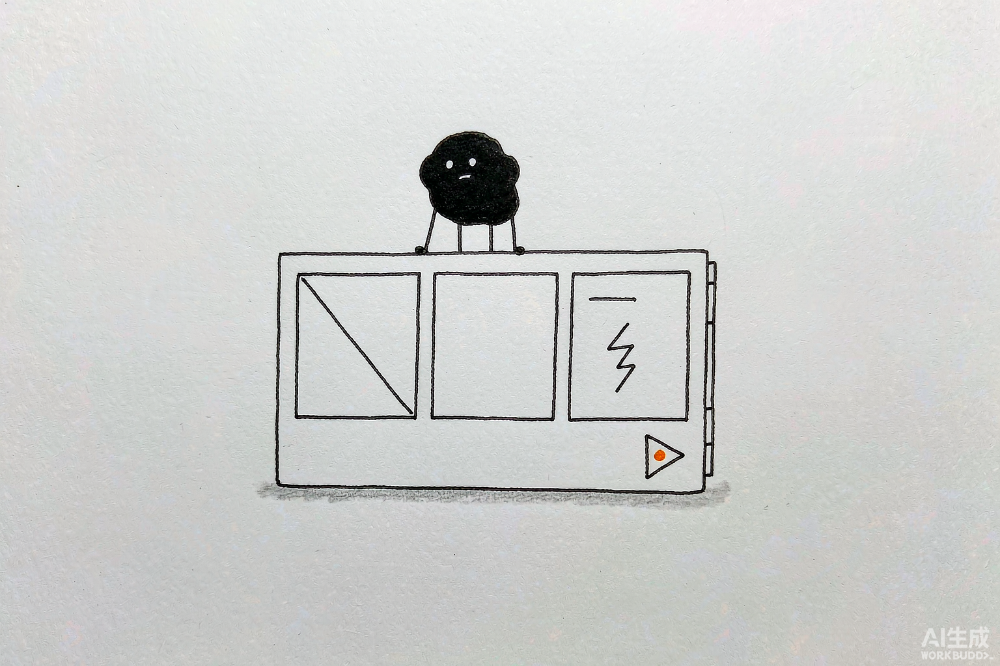

# 第 19 章 一句话召唤 AI 视频团队

> 内容来源：WorkBuddy 官方指南与社区实战案例整理（非官方，© 本指南作者，保留所有权利）

<Paywall part="2" variant="banner" />

做视频最劝退的是"要会写脚本、会画、会剪、会配音"。WorkBuddy 可以把这支团队塞进
一句话里：你给主题，它出脚本、出画面、出成片。这一章带你跑通"从一句话到一段视频"，
并示范怎么用 `skill-creator` **零代码**把你的视频风格固化成专属技能。

*配图为示意插画，用于帮助理解"AI 视频"，与实际软件界面无关。*

## 一、先想清楚：这支视频要交付什么

| 问题 | 要说清什么 | 示例 |
|-|-|-|
| 目标 | 视频用来干嘛 | 抖音/视频号一条 12 秒口播短视频 |
| 受众 | 谁看 | 对 AI 感兴趣的小白 |
| 材料 | 已有素材/设定 | 固定主角"小虎"、知性幽默基调 |
| 格式 | 时长/比例/风格 | 12 秒、竖屏 9:16、氛围感场景 |
| 验收 | 怎么判断可用 | 脚本逻辑顺、画面不崩、字幕不乱 |

## 二、先选对 Skill：AI 视频的组合

| 方式 / Skill | 适合处理 | 本章怎么用 | 注意点 |
|-|-|-|-|
| **视频生成技能（如内置 VideoGen / 即梦 / 可灵类）** | 文生视频、图生视频 | 脚本定稿后生成成片 | 需按官方文档开通相应能力 |
| **图像生成技能** | 分镜画面、封面、配图 | 先出关键帧再合成 | 风格要统一 |
| **字幕 / 配音技能** | 旁白朗读、加字幕 | 口语短句更自然 | 注意音色合规 |
| **剪辑 / 合成** | 拼镜头、加转场 | 出可发平台的成片 | 生成式视频仍需人工过一遍 |
| **skill-creator（零成本）** | 把视频风格固化 | "脱口秀文案"做成专属技能 | 见第四节 |

<Paywall part="2" />

*—— 以上试读到此为止。第二篇共 11 章，完整版 PDF 包含全部实操内容。——*
